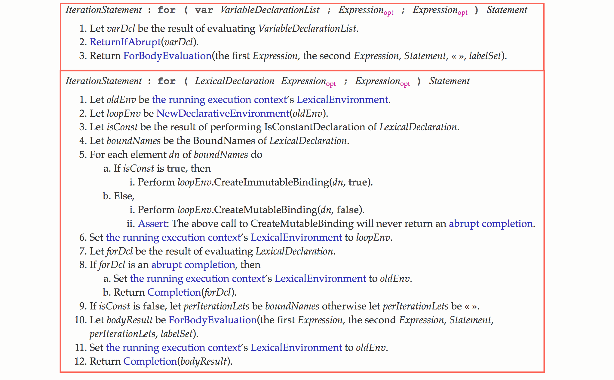

## let 和 const

### 块级作用域的出现

通过var声明的变量存在变量提升的特性：

```javascript
if(condition) {
    var value = 1;
}
console.log(value);
```
因为 var 关键字声明变量存在变量提升，所以代码相当于：

```javascript
var value;
if(condition) {
    value  = 1;
}
console.log(value);
```
如果condition为false，结果会是undefined。

除此之外，在for循环中：
```javascript
for(var i = 0; i < 10; i ++) {

}
console.log(i)//10
```
即便循环已经结束了，我们依然可以访问 i 的值。

为了加强对变量生命周期的控制，ECMAScript 6 引入了块级作用域。

块级作用域存在于：
* 函数内部
* 块中（字符 { 和 } 之间的区域）

### let和const

块级声明用于声明在指定块的作用域之外无法访问的变量。

let 和 const 都是块级声明的一种。

有如下特点：

##### 1.不会被提升
```
if(false) {
    let value = 1;
}
console.log(value) //Uncaught ReferenceError: value is not defined
```

##### 2.重复声明报错
```
var value = 1;
let value = 2; //Uncaught SyntaxError: Identifier 'value' has already been declared
```

##### 3.不绑定全局作用域

当在全局作用域使用 var 声明的时候，会创建一个新的全局变量作为全局对象的属性。
```
var value = 1;
console.log(window.value) //1
```
然而let和const的区别：

const用于声明常量，其值一旦被设定就不能再被修改，否则会报错。
值得一提的是： const声明不允许修改绑定，但允许修改值，这意味着当用const声明对象的时候：
```
const data = {
    value: 1
}

//没有问题
data.value = 2;
data.num = 3;

//报错
data = {}; //Uncaught TypeError: Assignment to constant variable.
```

#### 临时死区

临时死区(Temporal Dead Zone)，简写为 TDZ。

let 和 const 声明的变量不会被提升到作用域顶部，如果在声明之前访问这些变量，会导致报错：

```javascript
console.log(value)// Uncaught ReferenceError: value is not defined
let value = 1;
```

这是因为JavaScript引擎在扫描代码发现变量声明时，要么将它们提升到作用域顶部（遇到var声明），要么将声明放在TDZ中（遇到let和const声明），访问TDZ中的变量会触发运行时错误。只有执行过变量声明语句后，变量才会从TDZ中移除，然后方可访问。

```javascript
var value = 'global';
//eg1
(function() {
    console.log(value); //Uncaught ReferenceError: Cannot access 'value' before initialization

    let value = 'local';
}());

//eg2
{
		console.log(value); //Uncaught ReferenceError: Cannot access 'value' before initialization
  
  	const value = 'local';
}

```

两个例子中，结果并不会打印”global“,而是报错，就是因为 TDZ 的缘故。

#### 循环中的块级作用域

```javascript
var funcs = [];
for(var i = 0; i < 3; i ++) {
  funcs[i] = function () {
    console.log(i)
  }
}

funcs[0]() //3
```

解决方案

```javascript
var funcs = [];
for (var i = 0; i < 3; i ++) {
  funcs[i] = (function(i) {
		return function () {
      	console.log(i)
    }
  })(i)
}
```


ES6 let解决方案：

```javascript
var funcs = [];
for (let i = 0; i < 3; i ++) {
  funcs[i] = function () {
    console.log(i)
  }
}
funcs[0](); // 0
```

问题在于，上面讲了 let 不提升，不能重复声明，不能绑定全局作用域等等特性，可是为什么在这里就能正确打印出 i 值呢？

如果是不重复声明，在循环第二次的时候，又用 let 声明了 i，应该报错呀，就算因为某种原因，重复声明不报错，一遍一遍迭代，i 的值最终还是应该是 3 呀，还有人说 for 循环的
设置循环变量的那部分是一个单独的作用域，就比如：

```javascript
for (let i = 0; i < 3; i++) {
  let i = 'abc';
  console.log(i);
}
// abc
// abc
// abc
```

把let换成var

```javascript
for (var i = 0; i < 3; i++) {
  var i = 'abc';
  console.log(i);
}
// abc
```

如果要追究这个问题，就要抛弃掉之前所讲的这些特性！这是因为 let 声明在循环内部的行为是标准中专门定义的，不一定就与 let 的不提升特性有关，其实，在早期的 let 实现中就不包含这一行为。

我们看一下[ECMAScript 规范第 13.7.4.7 节](http://www.ecma-international.org/ecma-262/6.0/#sec-for-statement-runtime-semantics-labelledevaluation)



我们会发现，在 for 循环中使用 let 和 var，底层会使用不同的处理方式。

那么当使用 let 的时候底层到底是怎么做的呢？

简单的来说，就是在 `for (let i = 0; i < 3; i++)` 中，即圆括号之内建立一个隐藏的作用域，这就可以解释为什么:

```javascript
for (let i = 0; i < 3; i++) {
  let i = 'abc';
  console.log(i);
}
// abc
// abc
// abc
```

然后**每次迭代循环时都创建一个新变量，并以之前迭代中同名变量的值将其初始化**。这样对于下面这样一段代码

```javascript
var funcs = [];
for (let i = 0; i < 3; i++) {
    funcs[i] = function () {
        console.log(i);
    };
}
funcs[0](); // 0
```

相当于：

```javascript
// 伪代码
(let i = 0) {
    funcs[0] = function() {
        console.log(i)
    };
}

(let i = 1) {
    funcs[1] = function() {
        console.log(i)
    };
}

(let i = 2) {
    funcs[2] = function() {
        console.log(i)
    };
};
```

当执行函数的时候，根据词法作用域就可以找到正确的值，其实你也可以理解为 let 声明模仿了闭包的做法来简化循环过程。

#### 循环中的let和const

```JavaScript
var funcs = [];
for (const i = 0; i < 10; i++) {
    funcs[i] = function () {
        console.log(i);
    };
}
funcs[0](); // Uncaught TypeError: Assignment to constant variable.
```

结果会是报错，因为虽然我们每次都创建了一个新的变量，然而我们却在迭代中尝试修改 const 的值，所以最终会报错。

说完了普通的 for 循环，我们还有 for in 循环呢~

那下面的结果是什么呢？

```
var funcs = [], object = {a: 1, b: 1, c: 1};
for (var key in object) {
    funcs.push(function(){
        console.log(key)
    });
}

funcs[0]()
```

结果是 'c';

那如果把 var 改成 let 或者 const 呢？

使用 let，结果自然会是 'a'，const 呢？ 报错还是 'a'?

结果是正确打印 'a'，这是因为在 for in 循环中，每次迭代不会修改已有的绑定，而是会创建一个新的绑定。

##### Babel

```javascript
let value = 1;
```

编译为：

```javascript
var value = 1;
```

```javascript
if(false) {
  let value = 1;
}
console.log(value) // Uncaught ReferenceError: value is not defined
```

如果还是直接编译成 var，打印的结果肯定是 undefined，然而 Babel 很聪明，它编译成了：

```javascript
if(false) {
  var _value = 1;
}
console.log(value)
```

再写一个直观的例子：

```javascript
let value = 1;
{
  let value = 2;
}
value = 3;
```

```javascript
var value = 1;
{
  var _value = 2;
}
value = 3;
```

本质是一样的，就是改变量名，使内外层的变量名称不一样。

那像 const 的修改值时报错，以及重复声明报错怎么实现的呢？

其实就是在编译的时候直接给你报错……

那循环中的 let 声明呢？

```
var funcs = [];
for (let i = 0; i < 10; i++) {
    funcs[i] = function () {
        console.log(i);
    };
}
funcs[0](); // 0
```

Babel 巧妙的编译成了：

```
var funcs = [];

var _loop = function _loop(i) {
    funcs[i] = function () {
        console.log(i);
    };
};

for (var i = 0; i < 10; i++) {
    _loop(i);
}
funcs[0](); // 0
```

#### 最佳实践

在我们开发的时候，可能认为应该默认使用 let 而不是 var ，这种情况下，对于需要写保护的变量要使用 const。然而另一种做法日益普及：默认使用 const，只有当确实需要改变变量的值的时候才使用 let。这是因为大部分的变量的值在初始化后不应再改变，而预料之外的变量之的改变是很多 bug 的源头。