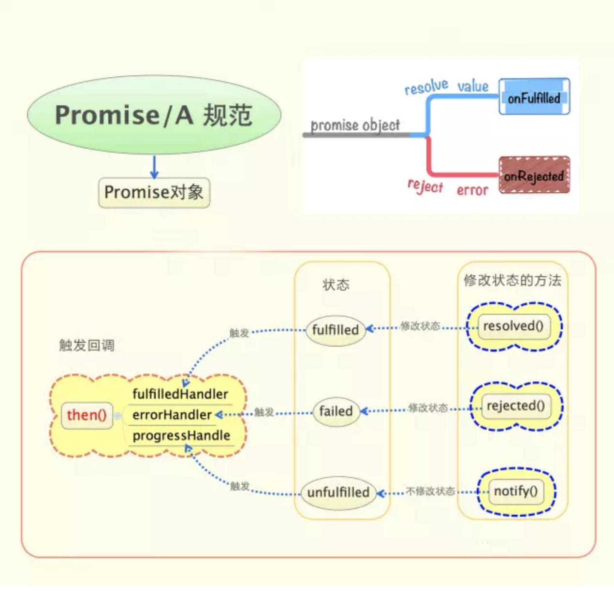

## Promise

所谓`Promise`，简单说就是一个容器，里面保存着某个未来才会结束的事件（通常是一个异步操作）的结果。从语法上说，Promise 是一个对象，从它可以获取异步操作的消息。Promise 提供统一的 API，各种异步操作都可以用同样的方法进行处理。

`Promise`对象有两个特点。

* 1.对象的状态不受外界的影响。Promise对象代表一个异步操作，有三种状态：`pending`（进行中）、`fulfilled`（已成功）和 `rejected`（已失败）。只有异步操作的结果，可以决定当前是哪种状态，任何其他操作都无法改变这个状态。这也是Promise这个名字的由来，它的英语意思就是承诺，表示其他手段无法改变。
* 2.一旦状态改变，就不会再变，任何时候都可以得到这个结果。`Promise`对象的状态改变，只有两种可能：从`pending`变为`fulfilled`和从`pending`变为`rejected`。只要这两种情况发生，状态就凝固了，不会再变了，会一直保持这个结果，这时就称为 resolved（已定型）。如果改变已经发生了，你再对`Promise`对象添加回调函数，也会立即得到这个结果。这与事件（Event）完全不同，事件的特点是，如果你错过了它，再去监听，是得不到结果的。

#### Promise三种状态：

* pending 过渡态
* fulfilled 完成态
* rejected 失败态

#### 状态改变只有两种可能

* 过渡态 => 成功态
* 过渡态 => 失败态

过程不可逆 无法相互转化

[具体使用方法参考阮老师文章](http://es6.ruanyifeng.com/#docs/promise)

[Promise实践](https://github.com/JimLiuxinghai/MyPromise)

