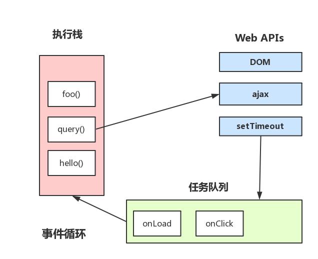

# JS浏览器事件循环机制

### 进程与线程

* 进程是系统分配的独立资源,是cpu资源分配的基本单位,进程是由一个或多个线程组成。
* 线程是进程的执行流，是cpu调度和分派的基本单位，同个进程中的多个线程共享该进程的资源。

### 浏览器内核

* 浏览器是多进程的，浏览器每一个 tab 标签都代表一个独立的进程（也不一定，因为多个空白 tab 标签会合并成一个进程），浏览器内核（浏览器渲染进程）属于浏览器多进程中的一种。

* 浏览器内核有多种线程在工作。
    * GUI渲染线程:
        * 负责渲染页面，解析 HTML，CSS 构成 DOM 树等，当页面重绘或者由于某种操作引起回流都会调起该线程。
        * 和 JS 引擎线程是互斥的，当 JS 引擎线程在工作的时候，GUI 渲染线程会被挂起，GUI 更新被放入在 JS 任务队列中，等待 JS 引擎线程空闲的时候继续执行。

    * JS引擎线程
        * 单线程工作，负责解析Javascript脚本
        * 和GUI渲染线程互斥，JS运行耗时过长会造成页面阻塞

    * 事件触发线程
        * 当事件符合触发条件时，该线程会把对应的事件回调函数添加到任务队列的队尾，等待JS引擎处理
    
    * 定时器触发线程
        * 浏览器定时计数器并不是由 JS 引擎计数的，阻塞会导致计时不准确。
        * 开启定时器触发线程来计时并触发计时，计时完成后会被添加到任务队列中，等待 JS 引擎处理。
    
    * HTTP请求线程
        * HTTP请求时会开启一条请求线程。
        * 请求完成有结果了之后，将请求的回调函数添加到任务队列中，等待 JS 引擎处理。

#### JavaScript 引擎是单线程

JavaScript 引擎是单线程，也就是说每次只能执行一项任务，其他任务都得按照顺序排队等待被执行，只有当前的任务执行完成之后才会往下执行下一个任务。

HTML5 中提出了 Web-Worker API，主要是为了解决页面阻塞问题，但是并没有改变 JavaScript 是单线程的本质。了解 [Web-Worker](https://developer.mozilla.org/zh-CN/docs/Web/API/Web_Workers_API)。

#### Javascript 事件循环机制

JavaScript 事件循环机制分为浏览器和 Node 事件循环机制，两者的实现技术不一样，浏览器 Event Loop 是 HTML 中定义的规范，Node Event Loop 是由 libuv 库实现。这里主要讲的是浏览器部分。

Javascript有一个main thread主线程，和call stack调用栈(执行栈)，所有的任务都会被放到调用栈等待主线程执行。

* JS调用栈

JS调用栈是一种后进先出的的数据结构。当函数被调用是，会被添加到栈顶，执行完成后就从栈顶移出该函数，直到栈被清空。

*  同步任务、异步任务

JavaScript 单线程中的任务分为同步任务和异步任务。同步任务会在调用栈中按照顺序排队等待主线程执行，异步任务则会在异步有了结果后将注册的回调函数添加到任务队列(消息队列)中等待主线程空闲的时候，也就是栈内被清空的时候，被读取到栈中等待主线程执行。任务队列是先进先出的数据结构。

* Event Loop

调用栈中的同步任务都执行完毕，栈被清空， 就代表主线程空闲了，这个时候就会去任务队列中按顺序放到栈内执行，每次被栈被清空，都会去读取任务队列有没有任务，有就读取执行，一直循环读取-执行的操作，就形成了事件循环。




* 定时器

定时器会开启一条定时器触发线程来触发计时，定时器会在等待了指定的时间后将事件放入到任务队列中等待读取到主线程执行。

定时器指定的延时毫秒数其实并不准确，因为定时器只是在到了指定的时间时将事件放入到任务队列中，必须要等到同步的任务和现有的任务队列中的事件全部执行完成之后，才会去读取定时器的事件到主线程执行，中间可能会存在耗时比较久的任务，那么就不可能保证在指定的时间执行。

* 宏任务(macro-task)、微任务(micro-task)

除了广义的同步任务和异步任务，JavaScript 单线程中的任务可以细分为宏任务和微任务。

macro-task包括：script(整体代码), setTimeout, setInterval, setImmediate, I/O, UI rendering。

micro-task包括：process.nextTick, Promises, Object.observe, MutationObserver。

### 事件循环的进程模型

* 选择当前要执行的任务队列，选择任务队列中最先进入的任务，如果任务队列为空即null，则执行跳转到微任务（MicroTask）的执行步骤。
* 将事件循环中的任务设置为已选择任务。
* 执行任务。
* 将事件循环中当前运行任务设置为null。
* 将已经运行完成的任务从任务队列中删除。
* microtasks步骤：进入microtask检查点。
* 更新界面渲染。
* 返回第一步。

### 执行进入microtask检查点时，用户代理会执行以下步骤：

* 设置microtask检查点标志为true。
* 当事件循环microtask执行不为空时：选择一个最先进入的microtask队列的microtask，将事件循环的microtask设置为已选择的microtask，运行microtask，将已经执行完成的microtask为null，移出microtask中的microtask。
* 设置进入micro检查点的标志为false

执行栈在执行完同步任务后，查看执行栈是否为空，如果执行栈为空，就会去执行Task（宏任务），每次宏任务执行完毕后，检查微任务(microTask)队列是否为空，如果不为空的话，会按照先入先出的规则全部执行完微任务(microTask)后，设置微任务(microTask)队列为null，然后再执行宏任务，如此循环。

举个🌰

```
console.log('script start');

setTimeout(function() {
  console.log('setTimeout');
}, 0);

Promise.resolve().then(function() {
  console.log('promise1');
}).then(function() {
  console.log('promise2');
});

console.log('script end');
```

* 第一步：执行同步代码，将宏任务（Tasks）和微任务(Microtasks)划分到各自队列中。
* 第二步：执行宏任务后，检测到微任务(Microtasks)队列中不为空，执行Promise1，执行完成Promise1后，调用Promise2.then，放入微任务(Microtasks)队列中，再执行Promise2.then。
* 第三步：当微任务(Microtasks)队列中为空时，执行宏任务（Tasks），执行setTimeout callback，打印日志。
* 第四步：清空Tasks队列和JS stack。

再举个🌰

```
console.log('script start')

async function async1() {
  await async2()
  console.log('async1 end')
}
async function async2() {
  console.log('async2 end') 
}
async1()

setTimeout(function() {
  console.log('setTimeout')
}, 0)

new Promise(resolve => {
  console.log('Promise')
  resolve()
})
  .then(function() {
    console.log('promise1')
  })
  .then(function() {
    console.log('promise2')
  })

console.log('script end')
```

这里需要先理解async/await。
async/await 在底层转换成了 promise 和 then 回调函数。
也就是说，这是 promise 的语法糖。
每次我们使用 await, 解释器都创建一个 promise 对象，然后把剩下的 async 函数中的操作放到 then 回调函数中。
async/await 的实现，离不开 Promise。从字面意思来理解，async 是“异步”的简写，而 await 是 async wait 的简写可以认为是等待异步方法执行完成。

### 关于73以下版本和73版本的区别

* 在73版本以下，先执行promise1和promise2，再执行async1。

    * 首先，传递给 await 的值被包裹在一个 Promise 中。然后，处理程序附加到这个包装的 Promise，以便在 Promise 变为 fulfilled 后恢复该函数，并且暂停执行异步函数，一旦 promise 变为 fulfilled，恢复异步函数的执行。
    * 每个 await 引擎必须创建两个额外的 Promise（即使右侧已经是一个 Promise）并且它需要至少三个 microtask 队列 ticks（tick为系统的相对时间单位，也被称为系统的时基，来源于定时器的周期性中断（输出脉冲），一次中断表示一个tick，也被称做一个“时钟滴答”、时标。）。

    ```
    async function f() {
        await p
        console.log('ok')
    }
    ```
    简化为
    ```
    function f() {
        return RESOLVE(p).then(() => {
            console.log('ok')
        })
    }
    ```
    * 如果 RESOLVE(p) 对于 p 为 promise 直接返回 p 的话，那么 p的 then 方法就会被马上调用，其回调就立即进入 job 队列。
    * 而如果 RESOLVE(p) 严格按照标准，应该是产生一个新的 promise，尽管该 promise确定会 resolve 为 p，但这个过程本身是异步的，也就是现在进入 job 队列的是新 promise 的 resolve过程，所以该 promise 的 then 不会被立即调用，而要等到当前 job 队列执行到前述 resolve 过程才会被调用，然后其回调（也就是继续 await 之后的语句）才加入 job 队列，所以时序上就晚了。

* 在73版本，先执行async1再执行promise1和promise2。
    * 使用对PromiseResolve的调用来更改await的语义，以减少在公共awaitPromise情况下的转换次数。
    * 如果传递给 await 的值已经是一个 Promise，那么这种优化避免了再次创建 Promise 包装器，在这种情况下，我们从最少三个 microtick 到只有一个 microtick。

详情参考[这里](https://v8.js.cn/blog/fast-async/)

### 引申

[https://juejin.im/post/59e85eebf265da430d571f89](https://juejin.im/post/59e85eebf265da430d571f89)

[https://juejin.im/post/59c25c936fb9a00a3f24e114](https://juejin.im/post/59c25c936fb9a00a3f24e114)

[https://segmentfault.com/a/1190000012925872](https://segmentfault.com/a/1190000012925872)


