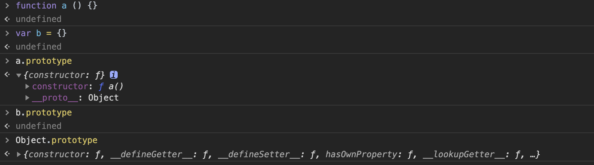

## 对象与原型

### 介绍

#### 创建对象

1.Object构造函数

```
var person = new Object();
```

2.对象字面量

```
var person = {};
```

3.工厂模式

```
function createPerson (name) {
    var o = new Object();
    o.name  = name;
    return o
}
var person1 = createPerson('jim');
```

4.构造函数模式

```
function Person (name) {
    this.name = name;
}
var person1 = new Person('jim');
```


每一个函数都有prototype的属性

```
function Person() {

}
// prototype是函数才会有的属性
Person.prototype.name = 'jim';
var person1 = new Person();
var person2 = new Person();
console.log(person1.name) // jim
console.log(person2.name) // jim
```

函数的 prototype 属性指向了一个对象，这个对象正是调用该构造函数而创建的实例的原型，也就是这个例子中的 person1 和 person2 的原型。

那什么是原型呢？你可以这样理解：每一个JavaScript对象(null除外)在创建的时候就会与之关联另一个对象，这个对象就是我们所说的原型，每一个对象都会从原型"继承"属性。

#### constructor

每个原型都有一个 constructor 属性指向关联的构造函数。
默认情况下constructor不可枚举

```
function Person() {

}
console.log(Person === Person.prototype.constructor); // true
```

特例：

当使用函数字面量重写原型对象时constructor就不会指向原型，而是新对象（Object构造函数）
```
Person.prototype = {
    name: 'jim'
}
var friend = new Person();
console.log(friend instanceof Object) //true
console.log(friend instanceof Person) //true
console.log(friend.constructor == Person) //false
console.log(friend.contructor == Object) //true
```

如何修复：
使用es5 中的 Object.defineProperty();

```
Person.prototype = {
    name: 'jim'
}
var friend = new Person();

Object.defineProperty(Person.prototype, 'constructor', {
    enumerable: false,
    value: Person
})
```

#### 原型链

当读取实例的属性时，如果找不到，就会查找与对象关联的原型中的属性，如果还查不到，就去找原型的原型，一直找到最顶层为止。

#### 原型方法

```
function Person () {

}
Person.prototype.name = 'jim';

var person1 = new Person();
var person2 = new Person();
person2.name = 'tom';

```
1.isPrototypeOf();
```
console.log(Person.prototype.isPrototypeOf(person1)) //true
```

2.getPrototypeOf

```
console.log(Object.getPrototypeOf(person1) == Person.prototype) //true
console.log(Object.getPrototypeOf(person1).name) //jim
```

3.hasOwnProperty()
```
console.log(person1.hasOwnProperty('name')) //false
console.log(person2.hasOwnProperty('name')) //true

```


### 注意

1.只有函数才有prototype属性, 对象没有


2.其实原型对象就是通过 Object 构造函数生成的，结合之前所讲，实例的 __proto__ 指向构造函数的 prototype.


