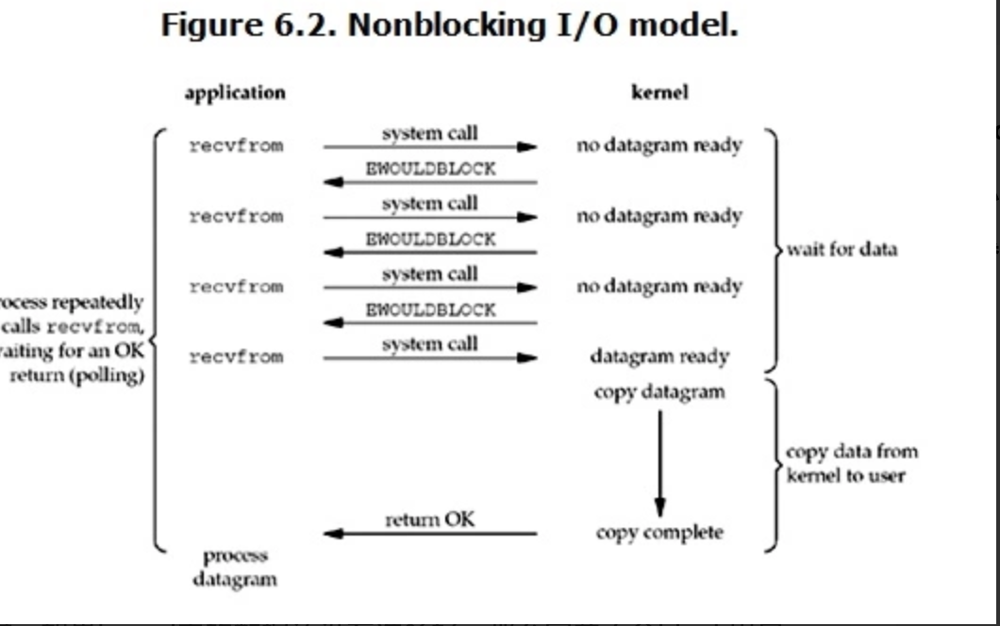

## 异步I/O与事件循环

### 一些概念

#### 同步异步 & 阻塞非阻塞

很多人都对`异步和非阻塞`的概念有点混淆， 其实两者是完全不同的， 同步异步指的是`行为即两者之间的关系`， 而阻塞非阻塞指的是`状态即某一方`。

以前端请求为一个例子，

```javascript
$.ajax(url).success(() => {
  //do someting
})
```

`同步异步`

如果是同步的话，那么应该是client发起请求后，一直等到server处理请求完成后才返回继续执行后续的逻辑，这样`client和server之间就保持了同步的状态`。

如果是异步的话，那么应该是client发起请求后，立即返回，而请求可能还没有到达server端或者请求正在处理，当然在异步情况下，client端通常会注册时间来处理请求完成后的情况，如上面的sucess函数。

`阻塞非阻塞`

首先需要明白一个概念，JS是单线程解释语言，但是请求是单独在网络线程。

如果是阻塞的话，那么`该线程就会一直等到这个请求完成之后才能被释放用于其他请求`

如果是非阻塞的话，那么`该线程就可以发起请求后而不用等请求完成继续做其他事情`

`总结`
之所以经常会混乱是因为没有说清楚讨论的是哪一部分（下面会提到）， 所以`同步异步讨论的对象是双方， 而阻塞非阻塞讨论的对象是自身`。

#### I/O和CPU

`I/O和CPU是可以同时进行工作的`。

* I/O:

  I/O(Input/Output),即输入和输出，通常指数据在内部存储器和外部存储器或其他设备之间的输入和输出。

* CPU

  解释计算机指令及处理计算机软件中的数据。

### Node中的异步I/O模型

I/O分为`磁盘I/O和网络I/O`,其具有两个步骤

* 1.等待数据准备(Waiting for the data to be ready)

* 2.将数据从内核拷贝到进程中(Copying the data from the kernek to the process)

#### Node中的磁盘I/O

以下的讨论基于*nix系统。

理想的异步I/O应该像上面讨论的一样：


而实际上，我们的系统并不能完美的实现这样的一种调用方式，Node的异步I/O，如读取文件等采用的是线程池的方式来实现，可以看到，Node通过另外一个线程来进行I/O操作,完成后在通知主线程：


#### Node中的网络I/O

在进入主题之前，我们先了解下Linux的I/O模式，这里推荐一篇[Linux I/O模式详解](https://segmentfault.com/a/1190000003063859#articleHeader9)：

`阻塞I/O(Blocking I/O)`


​	所以，blocking IO的特点就是在IO执行的两个阶段都被block了。

`非阻塞I/O（nonblocking I/O）`



​	当用户进程发出read操作时，如果kernel中的数据还没有准备好，那么它并不会block用户进程，而是立刻返回一个error。从用户进程角度讲 ，它发起一个read操作后，并不需要等待，而是马上就得到了一个结果。用户进程判断结果是一个error时，它就知道数据还没有准备好，于是它可以再次发送read操作。一旦kernel中的数据准备好了，并且又再次收到了用户进程的system call，那么它马上就将数据拷贝到了用户内存，然后返回。

`I/O 多路复用（ IO multiplexing）`


​	所以，I/O 多路复用的特点是通过一种机制一个进程能同时等待多个文件描述符，而这些文件描述符（套接字描述符）其中的任意一个进入读就绪状态，select()函数就可以返回。

`异步I/O(asynchronous I/O)`


​	用户进程发起read操作之后，立刻就可以开始去做其它的事。而另一方面，从kernel的角度，当它受到一个asynchronous read之后，首先它会立刻返回，所以不会对用户进程产生任何block。然后，kernel会等待数据准备完成，然后将数据拷贝到用户内存，当这一切都完成之后，kernel会给用户进程发送一个signal，告诉它read操作完成了。

而在Node中， 采用的是I/O 多路复用的模式， 而在I/O多路复用的模式中， 又具有read, select, poll, epoll等几个子模式， Node采用的是最优的epoll模式， 这里简单说下其中的区别， 并且解释下为什么epoll是最优的。

`read`

read。它是一种最原始、性能最低的一种，它会重复检查I/O的状态来完成数据的完整读取。在得到最终数据前，CPU一直耗用在I/O状态的重复检查上。下图是通过read进行轮询的示意图。


`select`

Select,它是在read的基础上改进的一种方案，通过对文件描述符上的时间状态进行判断。下图是通过select进行轮询的示意图。select轮询具有一个较弱的限制，那就是由于它采用了一个1024长度的数组来存储状态，也就是说它最多可以同时检查1024个文件描述符。


`poll`

poll比select有所改进，采用链表的方式表面数组长度的限制，其次它可以避免不必要的检查。但是文件描述符较多的时候，它的性能是十分低下的。


`epoll`

该方案是Linux下效率最高的I/O事件通知机制，在进入轮询的时候如果没有检查到I/O事件，将会进行休眠，直到事件发生将它唤醒。它是真实利用了事件通知，执行回调的方式，而不是遍历查询，所以不会浪费CPU，执行效率较高。

除此之外， 另外的poll和select还具有以下的缺点（引用自[文章](https://zhuanlan.zhihu.com/p/35958023)）：

1. 每次调用select，都需要把fd集合从用户态拷贝到内核态，这个开销在fd很多时会很大
2. 同时每次调用select都需要在内核遍历传递进来的所有fd，这个开销在fd很多时也很大
3. select支持的文件描述符数量太小了，默认是1024

epoll对于上述的改进;

​	epoll既然是对select和poll的改进，就应该能避免上述的三个缺点。那epoll都是怎么解决的呢？在此之前，我们先看一下epoll和select和poll的调用接口上的不同，select和poll都只提供了一个函数——select或者poll函数。而epoll提供了三个函数，epoll_create,epoll_ctl和epoll_wait，epoll_create是创建一个epoll句柄；epoll_ctl是注册要监听的事件类型；epoll_wait则是等待事件的产生。  对于第一个缺点，epoll的解决方案在epoll_ctl函数中。每次注册新的事件到epoll句柄中时（在epoll_ctl中指定EPOLL_CTL_ADD），会把所有的fd拷贝进内核，而不是在epoll_wait的时候重复拷贝。epoll保证了每个fd在整个过程中只会拷贝一次。  对于第二个缺点，epoll的解决方案不像select或poll一样每次都把current轮流加入fd对应的设备等待队列中，而只在epoll_ctl时把current挂一遍（这一遍必不可少）并为每个fd指定一个回调函数，当设备就绪，唤醒等待队列上的等待者时，就会调用这个回调函数，而这个回调函数会把就绪的fd加入一个就绪链表）。epoll_wait的工作实际上就是在这个就绪链表中查看有没有就绪的fd（利用schedule_timeout()实现睡一会，判断一会的效果，和select实现中的第7步是类似的）。  对于第三个缺点，epoll没有这个限制，它所支持的FD上限是最大可以打开文件的数目，这个数字一般远大于2048,举个例子,在1GB内存的机器上大约是10万左右，一般来说这个数目和系统内存关系很大。

Node中的异步网络I/O就是利用了epoll来实现， 简单来说， 就是利用一个线程来管理众多的I/O请求， 通过事件机制实现消息通讯。

### 事件循环

理解了Node中的磁盘I/O与网络I/O的底层实现后，可以看出Node是基于事件注册的方式在完成I/O后进行一系列的处理， 其内部是利用了事件循环的机制。

关于事件循环， 是指JS在每次执行完同步任务后会检查执行栈是否为空， 是的话就会去执行注册的事件列表， 不断的循环该过程。Node中的事件循环有六个阶段：


其中的每个阶段都会处理相应的事件：

* timers：执行setTimeout和setInterval中的callback
* pending callback：执行延迟到下一个循环迭代的I/O回调
* idle，prepare：仅供系统内部使用
* poll：检索新的 I/O 事件;执行与 I/O 相关的回调（几乎所有情况下，除了关闭的回调函数，它们由计时器和 setImmediate() 排定的之外），其余情况 node 将在此处阻塞。（即本文的内容相关））
* check：执行setImmediate()方法
* close callbacks: 执行close事件的callback，例如socket.on('close'[,fn])或者http.server.on('close, fn)。

ok， 这样就解释了Node是如何执行我们注册的事件， 那么还缺少一个环节， Node又是怎么把事件和IO请求对应起来呢？ 这里涉及到了另外一种中间产物请求对象。
以打开一个文件为例子：

```javascript
fs.open = function(path, flags, mode, callback){

//...

binding.open(pathModule._makeLong(path), stringToFlags(flags), mode, callback);

}

```

fs.open()的作用是根据指定路径和参数去打开一个文件，从而得到一个文件描述符，这是后续所有I/O操作的初始操作。从前面的代码中可以看到，JavaScript层面的代码通过调用C++核心模块进行下层的操作。


​	

​	从JavaScript调用Node的核心模块，核心模块调用C++内建模块，内建模块通过libuv进行系统调用，这是Node里经典的调用方式。这里libuv作为封装层，有两个平台的实现，实质上是调用了uv_fs_open()方法。在uv_fs_open()的调用过程中，我们创建了一个FSReqWrap请求对象。从JavaScript层传入的参数和当前方法都被封装在这个请求对象中，其中我们最为关注的回调函数则被设置在这个对象的oncomplete_sym属性上：

```javascript
req_wrap->object_->Set(oncomplete_sym, callback);
```


​	QueueUserWorkItem()方法接受3个参数：第一个参数是将要执行的方法的引用，这里引用的uv_fs_thread_proc；第二个参数是uv_fs_thread_proc方法运行时所需要的参数；第三个参数是执行的标志。当线程池中有可用线程时，我们会调用uv_fs_thread_proc()方法。uv_fs_thread_proc()方法会根据传入参数的类型调用相应的底层函数。以uv_fs_open()为例，实际上调用fs_open()方法。

至此，JavaScript调用立即返回，由JavaScript层面发起的异步调用的第一阶段就此结束。JavaScript线程可以继续执行当前任务的后续操作。当前的I/O操作在线程池中等待执行，不管它是否阻塞I/O，都不会影响到JavaScript线程的后续执行，如此就达到了异步的目的。

请求对象是异步I/O过程中的重要中间产物，所有的状态都保存在这个对象中，包括送入线程池等待执行以及I/O操作完毕后的回调处理。
 关于这一块其实个人认为不用过于细究， 大致上知道有这么一个请求对象即可， 最后总结一下整个异步IO的流程：

	

至此， Node的整个异步I/O流程都已经清晰了， 它是依赖于I/O线程池、epoll、事件循环、请求对象共同构成的一个管理机制。

### Node为什么更适合I/O密集

Node为人津津乐道的就是它更适合`I/O密集型`的系统， 并且具有`更好的性能`， 关于这一点其实与它的异步IO息息相关。

对于一个request而言, 如果我们依赖io的结果, 异步io和同步阻塞io（每线程/每请求）都是要等到io完成才能继续执行. 而同步阻塞io, 一旦阻塞就不会在获得cpu时间片, 那么为什么异步的性能更好呢?

其根本原因在于同步阻塞Io需要为`每一个请求创建一个线程`， 在Io的时候， 线程被block， 虽然不消耗cpu， 但是其本身具有内存开销， `当大并发的请求到来时， 内存很快被用光， 导致服务器缓慢`， 在加上， `切换上下文代价也会消耗cpu资源`。而Node的异步Io是通过事件机制来处理的， 它不需要为每一个请求创建一个线程， 这就是为什么Node的性能更高。

特别是在Web这种I/O密集型的情形下更具优势， 除开Node之外， 其实还有另外一种事件机制的服务器Ngnix, 如果明白了Node的机制对于Ngnix应该会很容易理解， 有兴趣的话推荐看[这篇文章](https://www.infoq.cn/article/2015/06/nginx-design-performance-scale-)。

在真正的学习Node异步I/O之前， 经常看到一些关于Node适不适合作为服务器端的开发语言的争论， 当然也有很多片面的说法。
 其实， 关于这个问题还是取决于你的业务场景。

假设你的业务是cpu密集型的， 那你采用Node来开发， 肯定是不适合的。 为什么不适合？ 因为Node是单线程， 你被阻塞在计算的时候， 其他的事件就做不了， 处理不了请求， 也处理不了回调。

那么在IO密集型中， Node就比Java好吗？ 其实也不一定， 还是要取决于你的业务。 如果你的业务是非常大的并发， 但是你的服务器资源又有限， 就好比现在有个入口， Node可以一次进10个人， 而Java依次排队进一个人， 如果是10个人同时进， 当然是Node更具有优势， 但是假设有100个人（如1w个异步请求之类）的话， 那么Node就会因为它的异步机制导致应用被挂起，内存狂飙，IO堵塞，而且不可恢复，这个时候你只能重启了。而Java却可以有序的处理， 虽然会慢一点。 而一台服务器挂了造成的线上事故的损失更是不可衡量的。（当然， 如果服务器资源足够的话， Node也能处理）。

最后， 事实上Java也是具有异步IO的库， 只是相对来说， Node的语法更自然更贴近， 也就更适合。


[js事件循环详解](https://zhuanlan.zhihu.com/p/55511602)


[事件循环及案例](https://juejin.im/post/5dd24ecce51d453fb903ff37#heading-6)