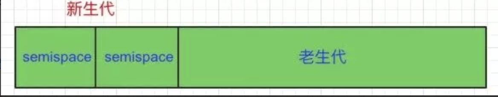
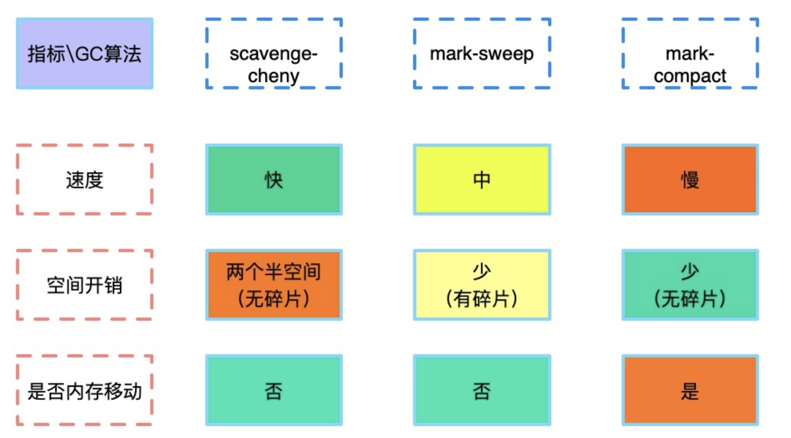
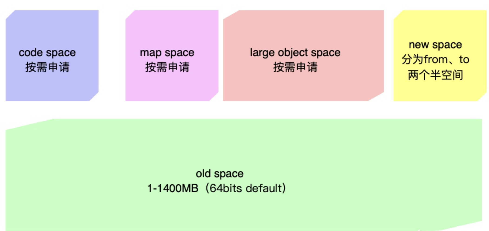

## 垃圾回收

垃圾回收器要解决的最基本问题就是，辨别需要回收的内存。一旦辨别完毕，这些内存区域即可在未来的分配中重用，或者是返还给操作系统。一个对象当它不是处于活跃状态的时候它就死了（废话）。一个对象处于活跃状态，当且仅当它被一个根对象或另一个活跃对象指向。根对象被定义为处于活跃状态，是浏览器或V8所引用的对象。比如说，被局部变量所指向的对象属于根对象，因为它们的栈被视为根对象；全局对象属于根对象，因为它们始终可被访问；浏览器对象，如DOM元素，也属于根对象，尽管在某些场合下它们只是弱引用。

从侧面来说，上面的定义非常宽松。实际上我们可以说，当一个对象可被程序引用时，它就是活跃的。比如：

```javascript
function f() {
	  var obj = {x: 12};
	  g();   // 可能包含一个死循环
	  return obj.x;
}
```

很遗憾，我们无法精确地解决这个问题，因为这个问题实际等价于停机问题，无法确定。因此我们做一个等价约定：如果一个对象可经由某个被定义为活跃对象的对象，通过某个指针链所访问，则它就是活跃的。其他的都被视为垃圾。

### V8的内存管理

Node程序运行中，此进程占用的所有内存成为常驻内存（Resident Set）

Node中通过 process.memoryUsage() 查看内存占用情况

```javascript
> process.memoryUsage()
{ 
  rss: 22953984,   //Resident Set Size 常驻内存总大小
  heapTotal: 9650176, // V8为堆内存分配的大小
  heapUsed: 5250040,  //已经使用的堆内存的大小
  external: 9695  //V8管理C++对象绑定到JavaScript对象上的内存 
}
```


常驻内存组成：

* 代码区(Code Segment)：存放即将执行的代码片段
* 栈(Stack)：存放局部变量
* 堆(Heap)：存放对象、闭包上下文
* 堆外内存：不通过V8分配，也不受V8管理。Buffer对象的数据就存放在这


除了堆外内存，其余都由V8管理

* 栈(Stack)的分配与回收非常直接，当程序离开某作用域后，其栈指针下移(回避)，整个作用域的局部变量都会出栈，内存收回。
* 最复杂的部分是堆(Heap)的管理，V8使用垃圾回收机制进行堆的内存管理，也是开发中可能造成内存泄露的部分。

事实上， 对于大文件的操作通常会使用`Buffer`， 究其原因就是因为Node中内存小的原因， 而使用`Buffer是不受这个限制`， 它是堆外内存， 也就是上面提到的`external`。


#### V8内存分代

目前没有一种垃圾自动回收算法适用于所有场景，所以V8的内部采用的其实是两种垃圾回收算法。他们回收的对象分别是生存周期较短和生存周期较长的两种对象。关于具体的算法，参考下文。 这里先介绍v8是怎么做内存分代的。

* 新生代

  `v8中的新生代主要存放的是生存周期较短的对象`， 它具有两个空间`semispace`， 分别为`From和To`， 在分配内存的时候将内存分配给From空间， 当垃圾回收的时候， 会检查From空间存活的对象(`广度优先算法`)并复制到To空间， 然后清空From空间， 再互相交换From和To空间的位置， 使得`To空间变为From空间`。

  该算法缺陷很明显就是有`一半的空间一直闲置着并且需要复制对象`， 但是由于新生代本身具有的内存比较小加上其分配的对象都是生存周期比较短的对象， 所以浪费的空间以及复制使用的开销会比较小。

  在64位系统中一个semisapce为`16MB`， 而32位则为`8MB`， 所以新生代内存大小分别为`32MB和16MB`。

* **Old Space**

  Old Space 保存的是老生代里的普通对象（在 V8 中指的是 Old Object Space，与保存对象结构的 Map Space 和保存编译出的代码的 Code Space 相对），这些对象大部分是从新生代（即 New Space）晋升而来。

* **Large Object Space**

  当 V8 需要分配一个 1MB 的页（减去 header）无法直接容纳的对象时，就会直接在 Large Object Space 而不是 New Space 分配。在垃圾回收时，Large Object Space 里的对象不会被移动或者复制（因为成本太高）。Large Object Space 属于老生代，使用 Mark-Sweep-Compact 回收内存

* **Map Space**

  所有在堆上分配的对象都带有指向它的“隐藏类”的指针，这些“隐藏类”是 V8 根据运行时的状态记录下的对象布局结构，用于快速访问对象成员，而这些“隐藏类”（Map）就保存在 Map Space。

* **Code Space**

  编译器针对运行平台架构编译出的机器码（存储在可执行内存中）本身也是数据，连同一些其它的元数据（比如由哪个编译器编译，源代码的位置等），放置在 Code Space 中。




#### V8的垃圾回收机制

**新生代**

新生代采用 `Scavenge`垃圾回收算法，在算法实现时主要采用`Cheney`算法。关于算法的实现在上面中已经大致说明了， 但新生代的对象是怎么晋升到老生代里面呢？

Scavenge算法将新生代的总空间一分为二，只使用其中一个，另一个处于闲置，等待垃圾回收时使用。使用中的那块空间称为**From**，闲置的空间称为**To**。


当新生代触发垃圾回收时，V8将From空间中所有应该存活下来的对象依次复制到To空间。

* 有两种情况不会将对象复制到To空间，而是**晋升**至老年代：

1. 对象此前已经经历过一次新生代垃圾回收，这次依旧应该存活，则晋升至老年代。
2. To空间已经使用了25%，则将此对象直接晋升至老年代。


From空间所有应该存活的对象都复制完成后，原本的From空间将被释放，成为闲置空间，原本To空间则成为使用中空间，两个空间进行**角色翻转**。
 为何To空间使用超过25%时，就需要直接将对象复制到老年代呢？因为To空间完成垃圾回收后将会翻转为From空间，新的对象分配都在此处进行，如果没有足够的空闲空间，将会影响程序的新对象分配。
 因为Scavenge只复制活着的对象，而根据统计学指导，新生代中大多数对象寿命都不长，长期存活对象少，则需要复制的对象相对来说很少，因此总体来说，新生代使用Scavenge算法的效率非常高。且由于Scavenge是依次连续复制，所以To空间永远不会存在内存碎片。
 不过由于Scavenge会将空间对半划分，所以此算法的空间利用率较低。

**老年代**

在老年代中的对象，至少都已经历过一次甚至更多次垃圾回收，相对于新生代中的对象，它们有更大的概率继续存活，只有相对少数的对象面临死亡，且由于老年代的堆内存是新生代的几十倍，其中生活着大量对象，因此如果使用Scavenge算法回收老年代，将会面临大量的存活对象需要复制的情况，将老年代空间对半划分，也会浪费相当大的空间，效率低下。因此老年代垃圾回收主要采用**标记清除(Mark-Sweep)**和**标记整理(Mark-Compact)**。
 这两种方式并非互相替代关系，而是配合关系，在不同情况下，选择不同方式，交替配合以提高回收效率。
 新生代中死亡对象占多数，因此采用Scavenge算法只处理存活对象，提高效率。老年代中存活对象占多数，于是采用**标记清除**算法只处理死亡对象，提高效率。
 当老年代的垃圾回收被触发时，V8会将需要存活对象打上标记，然后将没有标记的对象，也就是需要死亡的对象，全部擦除，一次**标记清除式**回收就完成了：


一切看起来都完美了，可是随着程序的继续运行，却会出现一个问题：被清除的对象遍布各个内存地址，空间有大有小，其闲置空间不连续，产生了很多内存碎片。当需要将一个足够大的对象晋升至老年代时，无法找到一个足够大的连续空间安置这个对象。
 为了解决这种空间碎片的问题，就出现了**标记整理**算法。它是在标记清除的基础上演变而来，当清理了死亡对象后，它会将所有存活对象往一端移动，使其内存空间紧挨，另一端就成为了连续内存：


虽然标记整理算法可以避免空间碎片，但是却需要依次移动对象，效率比标记清除算法更低，因此大多数情况下V8会使用标记清理算法，当空间碎片不足以安放新晋升对象时，才会触发标记整理算法。



**增量标记**

早期V8在垃圾回收阶段，采用全停顿（stop the world），也就是垃圾回收时程序运行会被暂停。这在JavaScript还仅被用于浏览器端开发时，并没有什么明显的缺点，前端开发使用的内存少，大多数时候仅触发新生代垃圾回收，速度快，卡顿几乎感觉不到。但是对于Node程序，使用内存更多，在老年代垃圾回收时，全停顿很容易带来明显的程序迟滞，标记阶段很容易就会超过100ms，因此V8引入了**增量标记**，将标记阶段分为若干小步骤，每个步骤控制在5ms内，每运行一段时间标记动作，就让JavaScript程序执行一会儿，如此交替，明显地提高了程序流畅性，一定程度上避免了长时间卡顿。


#### 堆的构成

v8将堆分为几个不同的区域：

* **新生区**：大多数对象被分配在这里。新生区是一个很小的区域，垃圾回收在这个区域非常频繁，与其他区域相独立。
* **老生指针区**：这里包含大多数可能存在指向其他对象的指针的对象，大多数新生区的对象存活一段时间后都会被挪到这里。
* **老生数据区**：这里存放只包含原始数据的对象（这些对象没有指向其他对象的指针）。字符串、封箱的数字以及未封箱的双精度数字数组，在新生区存活一段时间后会被移动到这里。
* **大对象区**：这里存放体积超越其他区大小的对象。每个对象有自己`mmap`产生的内存。垃圾回收器从不移动大对象。
* **代码区**：代码对象，也就是包含JIT之后指令的对象，会被分配到这里。这是唯一拥有执行权限的内存区（不过如果代码对象因过大而放在大对象区，则该大对象所对应的内存也是可执行的。*译注：但是大对象内存区本身不是可执行的内存区*）。
* **Cell区、属性Cell区、Map区**：这些区域存放Cell、属性Cell和Map，每个区域因为都是存放相同大小的元素，因此内存结构很简单。




### Node开发中的内存管理与优化

**手动销毁变量**

当任一作用域存活于作用域栈（作用域链）时，其中的变量都不会被销毁，其引用的数据也会一直被变量关联，得不到GC。有的作用域存活时间非常长（越是栈底，存活时间越长，最长的是**全局作用域**），但是其中的某些变量也许在某一时刻后就没有用处了，因此建议手动设置为null，断开引用链接，使得V8可以及时GC释放内存。
 注意，不使用var声明的变量，都会成为全局对象的属性。前端开发中全局对象为window，Node中全局对象为**global**，如果global中有属性已经没有用处了，一定要设置为null，因为全局作用域只有等到程序停止运行，才会销毁。
 Node中，当一个模块被引入，这个模块就会被缓存在内存中，提高下次被引用的速度。也就是说，一般情况下，整个Node程序中对同一个模块的引用，都是同一个实例（instance），这个实例一直存活在内存中。所以，如果任意模块中有变量已经不再需要，最好手动设置为null，不然会白白占用内存，成为“活着的死对象”。

**慎用闭包**

为了减轻GC压力，建议避免过深嵌套函数/闭包，或及早手动断开Context变量所引用的大对象。

**大内存的使用**

* 使用stream

  当我们需要操作大文件，应该利用Node提供的stream以及其管道方法，防止一次性读入过多数据，占用堆空间，增大堆内存压力。

* 使用Buffer

  Buffer是操作二进制数据的对象，不论是字符串还是图片，底层都是二进制数据，因此Buffer可以适用于任何类型的文件操作。
   Buffer对象本身属于普通对象，保存在堆，由V8管理，但是其储存的数据，则是保存在堆外内存，是有C++申请分配的，因此不受V8管理，也不需要被V8垃圾回收，一定程度上节省了V8资源，也不必在意堆内存限制。

  

[垃圾回收翻译（可达性）](https://segmentfault.com/a/1190000018605776)

[掘金](https://juejin.im/post/5ccd4f83e51d45368a619a5d)

[知乎：v8堆内存分析](https://zhuanlan.zhihu.com/p/70854476)