## filber

react在进行组件渲染时，从setState开始到渲染完成整个过程是同步的（“一气呵成”）。如果需要渲染的组件比较庞大，js执行会占据主线程时间较长，会导致页面响应度变差，使得react在动画、手势等应用中效果比较差。

为了解决这个问题，react团队经过两年的工作，重写了react中核心算法——[reconciliation](https://reactjs.org/docs/reconciliation.html)。并在v16版本中发布了这个新的特性。为了区别之前和之后的reconciler，通常将之前的reconciler称为stack reconciler，重写后的称为fiber reconciler，简称为Fiber。

### 卡顿原因

Stack reconciler的工作流程很像函数的调用过程。父组件里调子组件，可以类比为函数的递归（这也是为什么被称为stack reconciler的原因）。在setState后，react会立即开始reconciliation过程，从父节点（Virtual DOM）开始遍历，以找出不同。将所有的Virtual DOM遍历完成后，reconciler才能给出当前需要修改真实DOM的信息，并传递给renderer，进行渲染，然后屏幕上才会显示此次更新内容。对于特别庞大的vDOM树来说，reconciliation过程会很长(x00ms)，在这期间，主线程是被js占用的，因此任何交互、布局、渲染都会停止，给用户的感觉就是页面被卡住了。

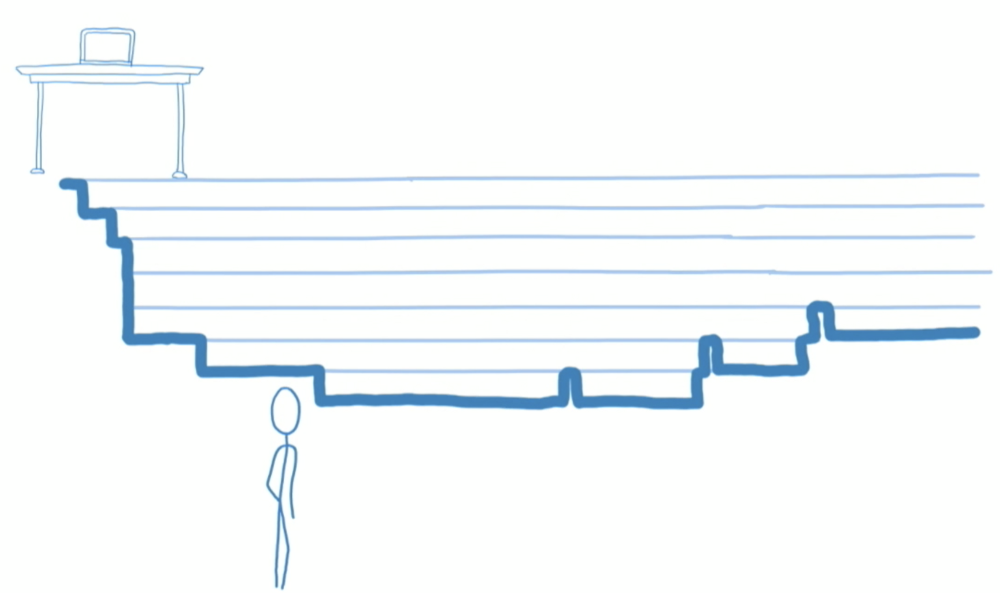

### Scheduler

scheduling(调度)是fiber reconciliation的一个过程，主要决定应该在何时做什么。👆的过程表明在stack reconciler中，reconciliation是“一气呵成”，对于函数来说，这没什么问题，因为我们只想要函数的运行结果，但对于UI来说还需要考虑以下问题：

- 并不是所有的state更新都需要立即显示出来，比如屏幕之外的部分的更新
- 并不是所有的更新优先级都是一样的，比如用户输入的响应优先级要比通过请求填充内容的响应优先级更高
- 理想情况下，对于某些高优先级的操作，应该是可以打断低优先级的操作执行的，比如用户输入时，页面的某个评论还在reconciliation，应该优先响应用户输入

所以理想状况下reconciliation的过程应该是像下图所示一样，每次只做一个很小的任务，做完后能够“喘口气儿”，回到主线程看下有没有什么更高优先级的任务需要处理，如果又则先处理更高优先级的任务，没有则继续执行([cooperative scheduling 合作式调度](https://www.w3.org/TR/requestidlecallback/))。

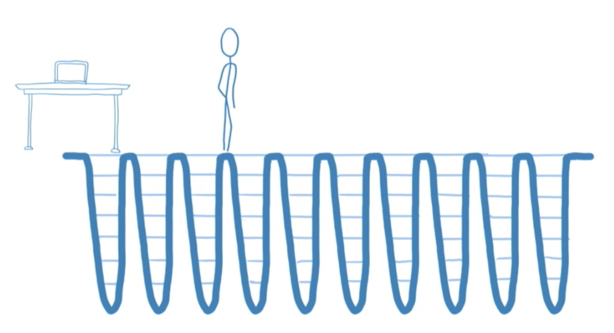

### 任务拆分 filber-tree&filber

先看一下stack-reconciler下的react是怎么工作的。代码中创建（或更新）一些元素，react会根据这些元素创建（或更新）Virtual DOM，然后react根据更新前后virtual DOM的区别，去修改真正的DOM。注意，**在stack reconciler下，DOM的更新是同步的，也就是说，在virtual DOM的比对过程中，发现一个instance有更新，会立即执行DOM操作**。

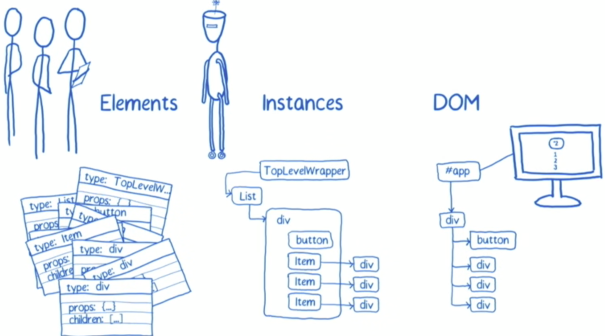

而fiber-conciler下，操作是可以分成很多小部分，并且可以被中断的，所以同步操作DOM可能会导致fiber-tree与实际DOM的不同步。对于每个节点来说，其不光存储了对应元素的基本信息，还要保存一些用于任务调度的信息。因此，fiber仅仅是一个对象，表征reconciliation阶段所能拆分的最小工作单元，和上图中的react instance一一对应。通过`stateNode`属性管理Instance自身的特性。通过child和sibling表征当前工作单元的下一个工作单元，return表示处理完成后返回结果所要合并的目标，通常指向父节点。整个结构是一个链表树。每个工作单元（fiber）执行完成后，都会查看是否还继续拥有主线程时间片，如果有继续下一个，如果没有则先处理其他高优先级事务，等主线程空闲下来继续执行。

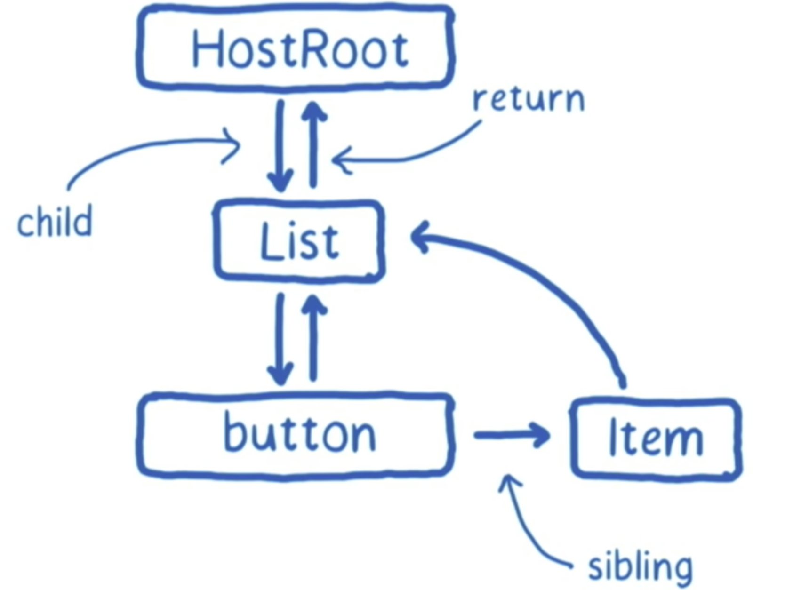

```
fiber {
  	stateNode: {},
    child: {},
    return: {},
    sibling: {},
}
```

#### 举个例子

当前页面包含一个列表，通过该列表渲染出一个button和一组item，item重包含一个div，其中的内容为数字。通过点击button，可以使列表中的所有数字进行平方。另外有一个按钮，点击调节字体大小。

页面渲染完成后，就会初始化生成一个fiber-tree。初始化fiber-tree和初始化Virtual DOM tree没什么区别，这里就不再赘述。

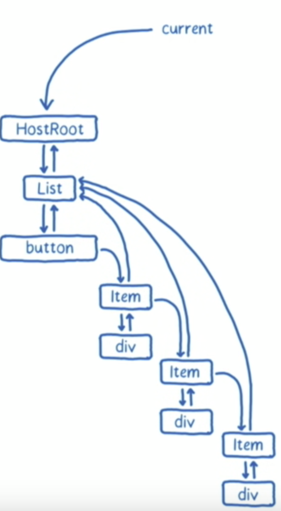

于此同时，react还会维护一个workInProgressTree。workInProgressTree用于计算更新，完成reconciliation过程。

用户点击平方按钮后，利用各个元素平方后的list调用setState，react会把当前的更新送入list组件对应的update queue中。但是react并不会立即执行对比并修改DOM的操作。而是交给scheduler去处理。

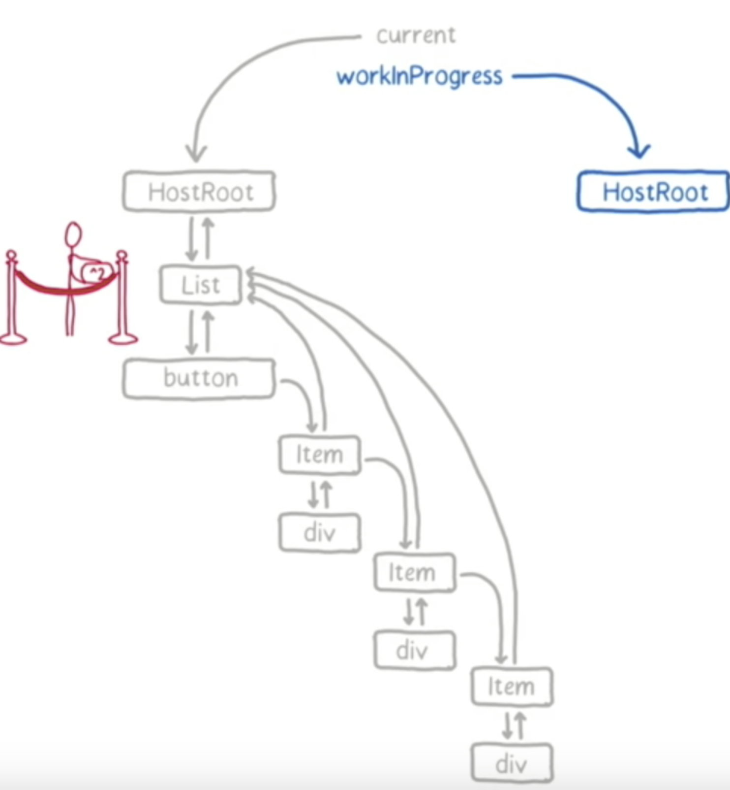

scheduler会根据当前主线程的使用情况去处理这次update。为了实现这种特性，使用了`requestIdelCallback`API。对于不支持这个API的浏览器，react会加上pollyfill。

总的来讲，通常，客户端线程执行任务时会以帧的形式划分，大部分设备控制在30-60帧是不会影响用户体验；在两个执行帧之间，主线程通常会有一小段空闲时间，`requestIdleCallback`可以在这个**空闲期（Idle Period）\**调用\**空闲期回调（Idle Callback）**，执行一些任务

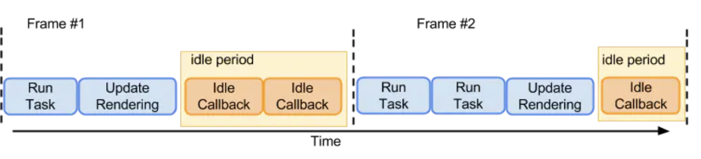

* 低优先级任务由`requestIdleCallback`处理；

* 高优先级任务，如动画相关的由`requestAnimationFrame`处理；

* `requestIdleCallback`可以在多个空闲期调用空闲期回调，执行任务；

* `requestIdleCallback`方法提供deadline，即任务执行限制时间，以切分任务，避免长时间执行，阻塞UI渲染而导致掉帧；

一旦reconciliation过程得到时间片，就开始进入work loop。work loop机制可以让react在计算状态和等待状态之间进行切换。为了达到这个目的，对于每个loop而言，需要追踪两个东西：下一个工作单元（下一个待处理的fiber）;当前还能占用主线程的时间。第一个loop，下一个待处理单元为根节点。

因为根节点上的更新队列为空，所以直接从fiber-tree上将根节点复制到workInProgressTree中去。根节点中包含指向子节点（List）的指针。

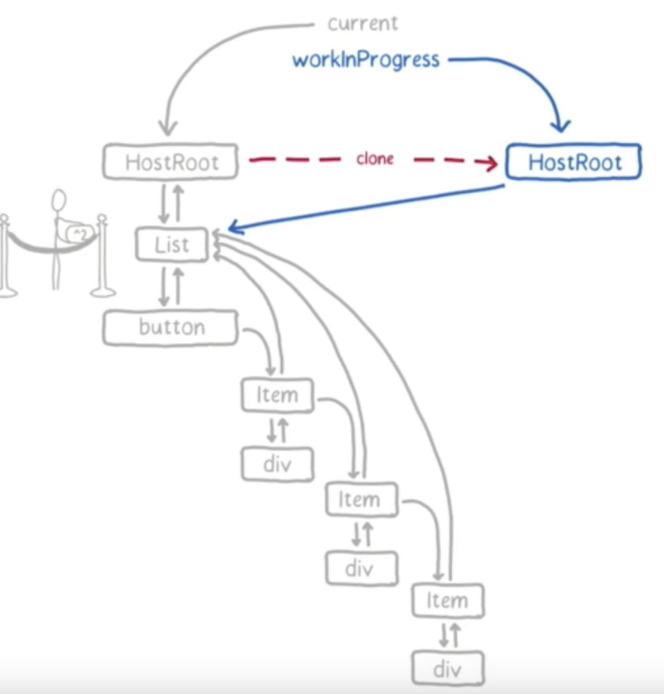

根节点没有什么更新操作，根据其child指针，接下来把List节点及其对应的update queue也复制到workinprogress中。List插入后，向其父节点返回，标志根节点的处理完成。

根节点处理完成后，react此时检查时间片是否用完。如果没有用完，根据其保存的下个工作单元的信息开始处理下一个节点List。

接下来进入处理List的work loop，List中包含更新，因此此时react会调用setState时传入的**updater funciton**获取最新的state值，此时应该是[1,4,9]。通常我们现在在调用setState传入的是一个对象，但在使用fiber conciler时，必须传入一个函数，函数的返回值是要更新的state。react从很早的版本就开始支持这种写法了，不过通常没有人用。在之后的react版本中，可能会废弃直接传入对象的写法。

```
setState({}, callback); // stack conciler
setState(() => { return {} }, callback); // fiber conciler
```

在获取到最新的state值后，react会更新List的state和props值，然后调用render，然后得到一组通过更新后的list值生成的**elements**。react会根据生成elements的类型，来决定fiber是否可重用。对于当前情况来说，新生成的elments类型并没有变（依然是Button和Item），所以react会直接从fiber-tree中复制这些elements对应的fiber到workInProgress 中。并给List打上标签，因为这是一个需要更新的节点。

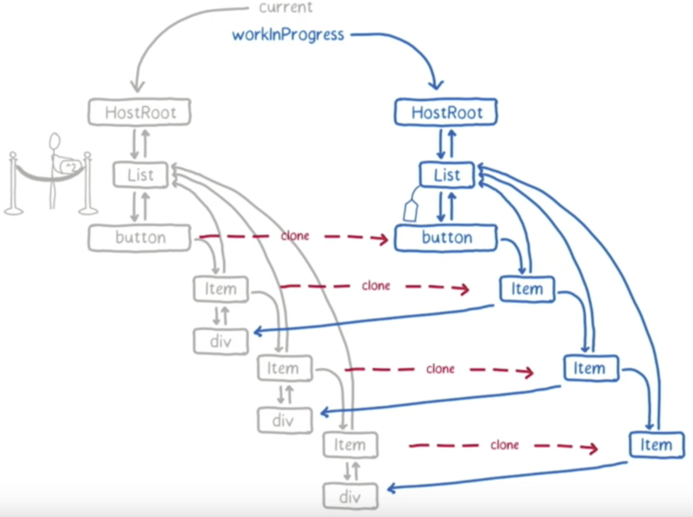

List节点处理完成，react仍然会检查当前时间片是否够用。如果够用则处理下一个，也就是button。加入这个时候，用户点击了放大字体的按钮。这个放大字体的操作，纯粹由js实现，跟react无关。但是操作并不能立即生效，因为react的时间片还未用完，因此接下来仍然要继续处理button。

button没有任何子节点，所以此时可以返回，并标志button处理完成。如果button有改变，需要打上tag，但是当前情况没有，只需要标记完成即可。

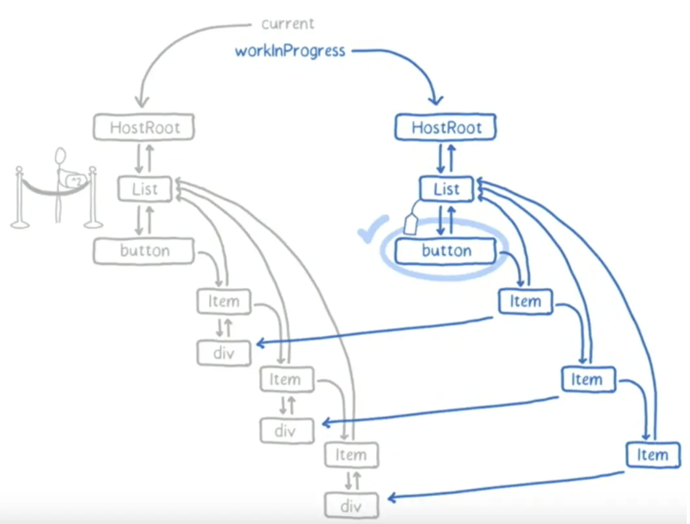

老规矩，处理完一个节点先看时间够不够用。注意这里放大字体的操作已经在等候释放主线程了。

接下来处理第一个item。通过shouldComponentUpdate钩子可以根据传入的props判断其是否需要改变。对于第一个Item而言，更改前后都是1,所以不会改变，shouldComponentUpdate返回false，复制div，处理完成，检查时间，如果还有时间进入第二个Item。

第二个Item shouldComponentUpdate返回true，所以需要打上tag，标志需要更新，复制div，调用render，讲div中的内容从2更新为4，因为div有更新，所以标记div。当前节点处理完成。

对于上面这种情况，div已经是叶子节点，且没有任何兄弟节点，且其值已经更新，这时候，需要将此节点改变产生的effect合并到父节点中。此时react会维护一个列表，其中记录所有产生effect的元素。

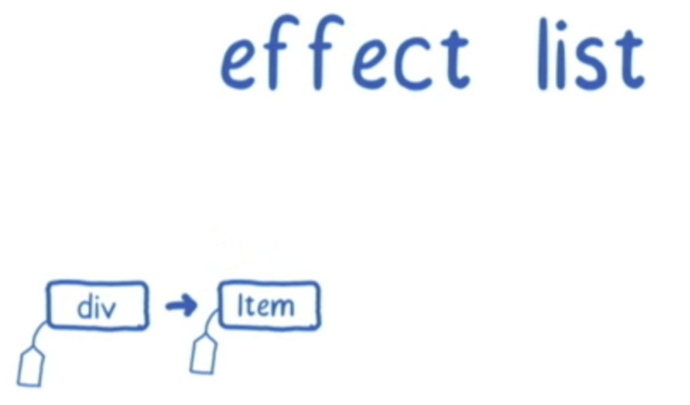

#### 小结

通过将reconciliation过程，分解成小的工作单元的方式，可以让页面对于浏览器事件的响应更加及时。但是另外一个问题还是没有解决，就是如果当前在处理的react渲染耗时较长，仍然会阻塞后面的react渲染。这就是为什么fiber reconciler增加了优先级策略。

### 优先级

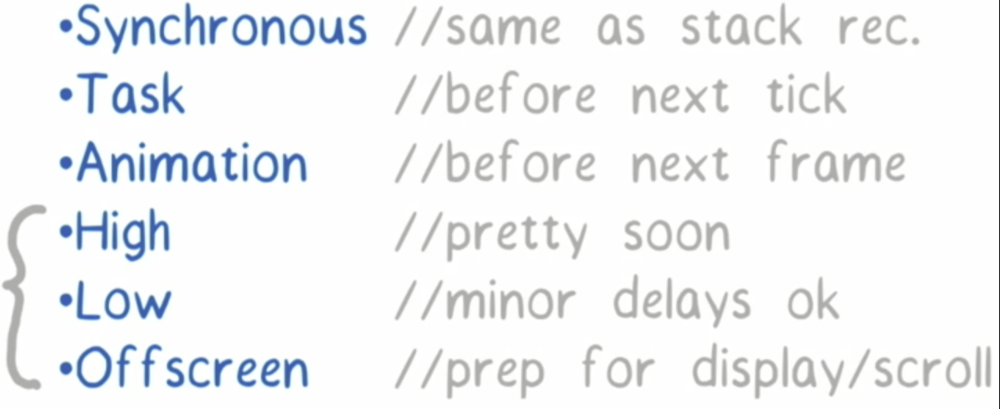

```javascript
module.exports = {
  NoWork: 0, // No work is pending.
  SynchronousPriority: 1, // For controlled text inputs. Synchronous side-effects.
  AnimationPriority: 2, // Needs to complete before the next frame.
  HighPriority: 3, // Interaction that needs to complete pretty soon to feel responsive.
  LowPriority: 4, // Data fetching, or result from updating stores.
  OffscreenPriority: 5, // Won't be visible but do the work in case it becomes visible.
};
```

优先级策略的核心是，在reconciliation阶段，低优先级的操作可以被高优先级的操作打断，并让主线程执行高优先级的更新，以时用户可感知的响应更快。值得注意的一点是，当主线程重新分配给低优先级的操作时，并不会从上次工作的状态开始，而是从新开始。

这就可能会产生两个问题：

- 饿死：正在实验中的方案是重用，也就是说高优先级的操作如果没有修改低优先级操作已经完成的节点，那么这部分工作是可以重用的。
- 一次渲染可能会调用多次声明周期函数

### 生命周期函数

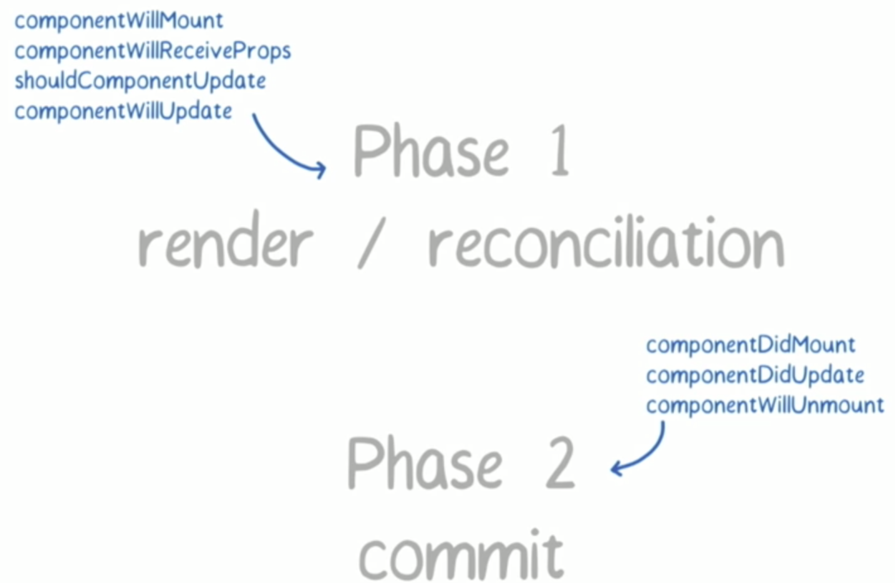

对于某些情况来说，phase1阶段的生命周期函数可能会不止执行一次。比如说，当一个低优先级的componentWillUpdate执行之后，被高优先级的打断，高优先级执行完之后，再回到低优先级的操作中来，componentWillUpdate可能会再执行一次。对于某些只期望执行一次，或者需要在两个生命周期函数的操作中执行对称操作的情况而言，要考虑这种case，确保不会让整个App crash掉。

