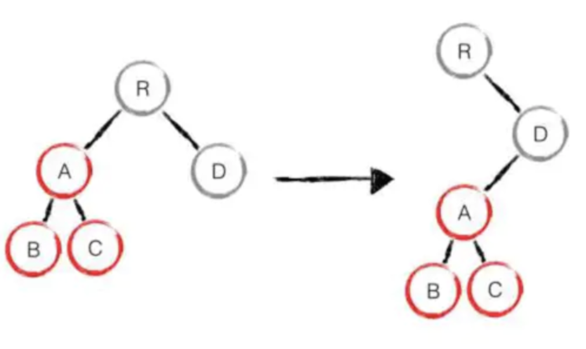

## 虚拟dom与diff算法

问题点：

- 1、vdom（Virtual DOM）是什么？为何会存在vdom？
- 2、vdom如何应用，核心api是什么？
- 3、vdom和jsx存在必然的关系吗？
- 4、介绍一下diff算法，
- 5、diff原理简单实现（核心）

### 1.介绍Virtual DOM

> Virtual DOM是对DOM的抽象，本质上是JavaScript对象，这个对象就是更加轻量级的对DOM的描述，提高重绘性能。

#### 1.1 DOM

DOM 全称为“文档对象模型”（Document Object Model），JavaScript 操作网页的接口。它的作用是将网页转为一个 JavaScript 对象，从而可以用脚本进行各种操作（比如增删内容）。

真实DOM

```html
<ul id='list'>
  <li class='item'>itemA</li>
  <li class='item'>itemB</li>
</ul>
```

```javascript
let ulDom = document.getElementById('list');
console.log(ulDom);
```


#### 1.2 什么是虚拟DOM

Virtual DOM（虚拟DOM）是对DOM的抽象，本质上是JavaScript对象，这个对象就是更加轻量级的对DOM的描述。简写为vdom。

比如上边的例子：真实DOM

```html
<ul id='list'>
  <li class='item'>itemA</li>
  <li class='item'>itemB</li>
</ul>
```

而虚拟DOM是：将真实dom数转换为js对象

```javascript
{  
    tag:'ul',  // 元素的标签类型
    attrs:{  //  表示指定元素身上的属性
        id:'list'
    },
    children:[  // ul元素的子节点
        {
            tag: 'li',
            attrs:{
                className:'item'
            },
            children:['itemA']
        },
        {   tag: 'li',
            attrs:{
                className:'item'
            },
            children:['itemB']
        }
    ]
}
```

* tag: 指定元素的标签类型，案例为：'ul'  （react中用type）

* attrs: 表示指定元素身上的属性，如id,class, style, 自定义属性等（react中用props）

* children: 表示指定元素是否有子节点，参数以数组的形式传入,如果是文本就是数组中为字符串

#### 1.3为什么会存在虚拟DOM

**既然我们已经有了DOM,为什么还需要额外加一层抽象？**

* 首先，我们都知道在`前端性能优化`的一个秘诀就是尽可能少地操作DOM,不仅仅是DOM相对较慢，更因为频繁变动DOM会造成浏览器的回流或者重绘，这些都是性能的杀手，因此我们需要这一层抽象，在patch过程中尽可能地一次性将差异更新到DOM中，这样保证了DOM不会出现性能很差的情况.

* 其次，现代前端框架的一个基本要求就是无须手动操作DOM,一方面是因为手动操作DOM无法保证程序性能，多人协作的项目中如果review不严格，可能会有开发者写出性能较低的代码，另一方面更重要的是省略手动DOM操作可以大大提高开发效率.

* 打开了函数式UI编程的大门，

* 最后，也是Virtual DOM最初的目的，就是更好的跨平台，比如Node.js就没有DOM,如果想实现SSR(服务端渲染),那么一个方式就是借助Virtual DOM,因为Virtual DOM本身是JavaScript对象. 而且在的ReactNative，React VR、weex都是使用了虚拟dom。

**为啥说dom操作是“昂贵”的，js运行效率高？**

例如：我们只在页面创建一个简单的div元素，打印出来，我们输出可以看到

```javascript
var div = document.createElement(div);
var str = '';
for(var key in div){
    str += key+' ';
}
console.log(str)
```


如图所示，真正的DOM元素是非常庞大的，因为浏览器的标准就把DOM设计的非常复杂。当我们频繁的去做DOM更新，导致页面重排，会产生一定的性能问题。

为了更好的了解虚拟dom，在这之前需要了解浏览器的运行机制。

#### 1.4 虚拟DOM的缺点

* 首次渲染大量 DOM 时，由于多了一层虚拟 DOM 的计算，会比 innerHTML 插入慢。虚拟 DOM 需要在内存中的维护一份 DOM 的副本。

* 如果你的场景是虚拟 DOM 大量更改，这是合适的。但是单一的，频繁的更新的话，虚拟 DOM 将会花费更多的时间处理计算的工作。比如，你有一个 DOM 节点相对较少页面，用虚拟 DOM，它实际上有可能会更慢。但对于大多数单页面应用，这应该都会更快。这也是为啥react和vue中的更新用了异步的方法，频繁更新时，只更新最后一次的。

#### 1.5 虚拟DOM总结

- 虚拟dom是一个js对象
- DOM操作是”昂贵“的，js运行效率高
- 尽量减少DOM操作，而不是”推到重来“
- 项目越复杂，影响越严重
- 更好的跨平台


### 2.简述VDOM的实现流程和核心API

> 前端框架中react和vue均不同程度的使用了虚拟dom的技术，因此通过一个简单的库来学习虚拟dom技术在由浅及深的了解就十分必要了

我们借用snabbdom库来讲解一下：

api：[snabbdom](https://github.com/snabbdom/snabbdom) ：[github.com/snabbdom/sn…](https://github.com/snabbdom/snabbdom)

当然你还可以看库[virtual-dom](https://github.com/Matt-Esch/virtual-dom)：[github.com/Matt-Esch/v…](https://github.com/Matt-Esch/virtual-dom)


#### 2.1 snabbdom的虚拟dom实现

- compile，如何把真实DOM编译成vnode虚拟节点对象。（通过h函数）
- diff，通过算法，我们要如何知道oldVnode和newVnode之间有什么变化。（内部diff算法）
- patch， 如果把这些变化用打补丁的方式更新到真实dom上去。


我们从上变的代码可以发现：

h 函数接受是三个参数，分别代表是 DOM 元素的`标签名、属性、子节点（children有多个子节点）`，最终返回一个虚拟 DOM 的对象；我可以看到在返回的虚拟节点中还有key（节点的唯一标识）、text（如果是文本节点时对应的内容）

定义patch更新vnode

```javascript
//定义 patch
    let patch = snabbdom.init([
        snabbdom_class,
        snabbdom_props,
        snabbdom_style,
        snabbdom_eventlisteners
    ]);
    // 获取container的dom
    let container = document.getElementById('container');
    // 第一次patch 
    patch(container,vnode);
```


可以看到渲染成功了，需要注意的是在第一次patch的时候vnode是**覆盖**了原来的真是dom（

），这跟react中的render不同，**render是在此dom上增加子节点**

#### 2.2 react中初步虚拟DOM

react中使用了jsx语法，与snabbdom不同，会先将代码通过babel转换。

##### 2.2.1 dom tree定义

```react
import React from 'react';
import ReactDOM from 'react-dom';

ReactDOM.render(<h1>hello,lee</h1>, document.getElementById('root'));
```

发现React引入 并没有使用，但是我们用babel转一下


有子节点的 tree

```javascript
import React from 'react';
import ReactDOM from 'react-dom';

ReactDOM.render(
<ul id="list">
  <li className="item">itemA</li> 
  <li className="item">itemB</li> 
</ul>, 
document.getElementById('root'));
```

编译后

```javascript
React.createElement("ul", {
  id: "list"
}, React.createElement("li", {
  class: "item"
}, "itemA"), React.createElement("li", {
  class: "item"
}, "itemB"));
```

- `react.js` 是 React 的核心库
- `react-dom.js` 是提供与DOM相关的功能,内部比较重要的方法是render,它用来向浏览器里插入DOM元素

##### 2.2.2 函数组件

```react
import React from 'react';
import ReactDOM from 'react-dom';

function Welcome(props){
   return (

       <h1>hello ,{props.name}</h1>

   )
}

ReactDOM.render( <Welcome name='lee' /> , document.getElementById('root'));
```

上边的welcome是函数组件，函数组件接收一个单一的`props`对象并返回了一个React元素，通过babel编译可以看到如下：

```react
function Welcome(props) {
  return React.createElement("h1", null, "hello ,", props.name);
}
```

##### 2.2.3 类组件

```react
import React from 'react';
import ReactDOM from 'react-dom';

class Welcome1 extends React.Component{
    render(){
       return (
       <h1>hello ,{this.props.name}</h1>
   ) 
    }
}
ReactDOM.render( < Welcome1 name = 'lee' / > , document.getElementById('root'));
```

welcome1是类组件编译返回的是如下：

```javascript
class Welcome1 extends React.Component {
  render() {
    return React.createElement("h1", null, "hello ,", this.props.name);
  }

}
```

##### 2.2.4 文本

```react
import React from 'react';
import ReactDOM from 'react-dom';

ReactDOM.render( '<h1>hello,lee</h1>' , document.getElementById('root'));
```

此时将会把`<h1>hello,lee</h1>'`作为文本插入到页面。

##### 总结:

* 1、React.createElement()函数：跟snabbdom中的h函数很类似，

h函数：[类型，属性，子节点]三个参数最后一个如果有子节点时放到数组中；

React.createElement(): 第一个参数也是类型，第二个参数表示属性值，第三个及之后表示的是子节点。

* 2、ReactDOM.render()：就类似patch()函数了，只是参数顺序颠倒了。

ReactDOM.render():第一个参数是vnode,第二个是要挂在的真实dom；

patch()函数：第一个参数vnode虚拟dom，或者是真实dom，第二个参数vnode;

**注意**

* React元素不但可以是DOM标签，还可以是用户自定义的组件

* 当 React 元素为用户自定义组件时，它会将 JSX 所接收的属性（attributes）转换为单个对象传递给组件，这个对象被称之为 `props`

* 组件名称必须以大写字母开头

* 组件必须在使用的时候定义或引用它

* 组件的返回值只能有一个根元素

* **render()时注意**

  **1、需要注意特殊处理一些属性，如：style、class、事件、children等**

  **2、定义组件时区分类组件和函数组件及标签组件**

### 3.diff算法实现流程原理

> diff是来比较差异的算法

#### 3.1 什么事diff算法

是用来对比差异的算法，有 linux命令 `diff`（我们dos命令中执行diff 两个文件可以比较出两个文件的不同）、git命令`git diff`、可视化diff(github、gitlab...)等各种实现。

#### 3.2 vdom为何使用diff算法

我们上边使用snabbdom.js的案例中，patch(vnode,newVnode)就是通过这个diff算法来判断是否有改变两个虚拟dom之间，没有就不用再渲染到真实dom树上了，节约了性能。

vdom使用diff算法是为了找出需要更新的节点。vdom使用diff算法来比对两个虚拟dom的差异，以最小的代价比对2颗树的差异，在前一个颗树的基础上生成最小操作树，但是这个算法的时间复杂度为n的三次方=O(n*n*n)，当树的节点较多时，这个算法的时间代价会导致算法几乎无法工作。

#### 3.3 diff算法的实现规则

##### 3.3.1 同级节点比较 不能跨级


##### 3.3.2 先序深度优先，广度优先

1.深度优先


2.广度优先

从某个顶点出发，首先访问这个顶点，然后找出这个结点的所有未被访问的邻接点，访问完后再访问这些结点中第一个邻接点的所有结点，重复此方法，直到所有结点都被访问完为止。

#### 3.4 snabbdom和vue中dom-diff实现原理流程

* 在比较之前我们发现snabbdom中是用patch同一个函数来操作的，所以我们需要判断。第一个参数传的是虚拟dom还是 HTML 元素 。

* 再看源码的时候发现snabbdom中将html元素转换为了虚拟dom在继续操作的。这是为了方便后面的更新，更新完毕后在进行挂载。

* 通过方法来判断是否是同一个节点

  方法：比较新节点（newVnode）和（oldVnode）的`sel`（其他的库中可能叫`type`） key两个属性是否相等，不定义key值也没关系，因为不定义则为undefined,而undefined===undefined，如果不同（比如sel从`ul`改变为了`p`），直接用通过newVnode的dom元素替换oldVnodedom元素，因为dom-diff是按照层级分解树的，只有同级别比较,不会跨层移动vnode。不会在比较他们的children。如果不同再具体去比较其差异性，在旧的vnode上进行’打补丁’ 。

  

  ps:其实 在用vue的时候，在没有用v-for渲染的组件的条件下，是不需要定义key值的，也不会影响其比较。

* data 属性更新

  循环老的节点的data，属性，如果跟新节点data不存在就删除，最后在都新增加到老的节点的elm上；

  需要特殊处理style、class、props，其中需要排除key\id,因为会用key来进行diff比较，没有key的时候会用id,都有当前索引。

* children比较

  * 新节点的children是文本节点且oldvnode的text和vnode的text不同，则更新为vnode的text

  * 判断双方是只有一方有children

    * 如果老节点有children，新的没有，老节点children直接都删除
    * 如果老节点的children没有，新的节点的children有，直接创建新的节点的children的dom引用到老的节点children上。

  * 将旧新vnode分别放入两个数组比较（最难点）

    **以下为了方便理解我们将新老节点两个数组来说明，实现流程。 用的是双指针的方法，头尾同时开始扫描；**

    **重复下面的五种情况的对比过程，直到两个数组中任一数组的头指针（开始的索引）超过尾指针（结束索引），循环结束 :**

    ```
    oldStartIdx：老节点的数组开始索引，
    oldEndIdx：老节点的数组结束索引，
    newStartIdx：新节点的数组开始索引
    newEndIdx：新节点的数组结束索引
    
    oldStartVnode：老的开始节点
    oldEndVnode：老的结束节点
    newStartVnode：新的开始节点
    newEndVnode：新的结束节点
    
     循环两个数组，循环条件为（oldStartIdx <= oldEndIdx && newStartIdx <= newEndIdx）
    
    ```

    

    

  **首尾比较的状况**

  ```
  1、 头头对比：oldStartVnode - > newStartVnode
  2、 尾尾对比：oldEndVnode - > newEndVnode
  3、 老尾与新头对比： oldEndVnode- > newStartVnode
  4、 老头与新尾对比：oldStartVnode- > newEndVnode
  5、 利用key对比
  ```

  * 情况1: 头头对比：

    判断oldStartVnode、newStartVnode是否是同一个vnode： 一样：patch(oldStartVnode,newChildren[newStartIdx]);

    ++oldStartIdx,++oldStartIdx ，

    oldStartVnode =  oldChildren[oldStartIdx]、newStartVnode = newChildren[oldStartIdx ]；

    **针对一些dom的操作进行了优化**：在尾部增加或者减少了节点；

    例子1：节点：`ABCD =>ABCDE` `ABCD => ABC`

    开始时：

    ```
    oldChildren:['A','B','C','D']
    oldStartIdx:0
    oldStartVnode: A虚拟dom
    oldEndIdx:3
    oldEndVnode:D虚拟dom
    newChildren:['A','B','C','D','E']
    newStartIdx:0
    newStartVnode:A虚拟dom
    newEndIdx:4
    newEndVnode:E虚拟dom
    ```

    

    比较过后，

    ```
    oldChildren:['A','B','C','D']
    oldStartIdx:4
    oldStartVnode: undefined
    oldEndIdx:3
    oldEndVnode:D虚拟dom
    newChildren:['A','B','C','D','E']
    newStartIdx:4
    newStartVnode:D虚拟dom
    newEndIdx:4
    newEndVnode:E虚拟dom
    ```

    `newStartIndex <= newEndIndex` ：说明循环比较完后，新节点还有数据，这时候需要将这些虚拟节点的创建真是dom新增引用到老的虚拟dom的`elm`上,且新增位置是老节点的oldStartVnode即末尾；

    `newStartIndex > newEndIndex` ：说明newChildren已经全部比较了，不需要处理；

    `oldStartIdx>oldEndIdx`: 说明oldChildren已经全部比较了，不需要处理；

    `oldStartIdx <= oldEndIdx`  :说明循环比较完后，老节点还有数据，这时候需要将这些虚拟节点的真是dom删除；

  * 情况2：尾尾对比

    判断oldEndVnode、newEndVnode是否是同一个vnode：

    一样：patch(oldEndVnode、newEndVnode)；

    --oldEndIdx，--newEndIdx；

    oldEndVnode =  oldChildren[oldEndIdx]；newEndVnode =  newChildren[newEndIdx]，

    **针对一些dom的操作进行了优化**：在头部增加或者减少了节点；

    例子2：节点：`ABCD =>EFABCD`    `ABCD => BCD`

    开始时：

    ```
    oldChildren:['A','B','C','D']
    oldStartIdx:0
    oldStartVnode: A虚拟dom
    oldEndIdx:3
    oldEndVnode:D虚拟dom
    newChildren:['E','A','B','C','D']
    newStartIdx:0
    newStartVnode:E虚拟dom
    newEndIdx:4
    newEndVnode:D虚拟dom
    ```

    

    比较过后，

    ```
    oldChildren:['A','B','C','D']
    oldStartIdx:0
    oldStartVnode: A虚拟dom
    oldEndIdx:-1
    oldEndVnode: undefined
    newChildren:['E','A','B','C','D']
    newStartIdx:0
    newStartVnode:E虚拟dom
    newEndIdx:1
    newEndVnode:A虚拟dom
    ```

  * 情况3、老尾与新头对比：

    判断oldStartVnode跟newEndVnode比较vnode是否相同：

    一样：patch(oldStartVnode、newEndVnode)；

    将老的oldStartVnode移动到newEndVnode的后边，

    ++oldStartIdx ；

    --newEndIdx；

    oldStartVnode = oldChildren[oldStartIdx] ；

    newEndVnode =  newChildren[newEndIdx];

    **针对一些dom的操作进行了优化：**在头部增加或者减少了节点；

    例子3：节点：`ABCD => BCDA`

    开始时：

    ```
    oldChildren:['A','B','C','D']
    oldStartIdx:0
    oldStartVnode: A虚拟dom
    oldEndIdx:3
    oldEndVnode:D虚拟dom
    newChildren:['B','C','D','A']
    newStartIdx:0
    newStartVnode:B虚拟dom
    newEndIdx:3
    newEndVnode:A虚拟dom
    ```

    

    ```
    ['A','B','C','D']  -> ['B','C','D','A']
    1：老[0] -> 新[0] 不等 
    2: 老[3] -> 新[3] 不等  
    3：老[0] -> 新[3] 相等  
     移动老[0].elm到老[3].elm后
    ++oldStartIdx;--newEndIdx;移动索引指针来比较
    以下都按照情况一来比较了
    4: 老[1] -> 新[0] 相等，
    5：老[2] -> 新[1] 相等
    6：老[3] -> 新[2] 相等
    
    ```

    比较过后

    ```
    oldChildren:['A','B','C','D']
    oldStartIdx:4
    oldStartVnode: undefined
    oldEndIdx:3
    oldEndVnode:D虚拟dom
    newChildren:['B','C','D','A']
    newStartIdx:3
    newStartVnode:A虚拟dom
    newEndIdx:2
    newEndVnode:D虚拟dom
    ```

  * 情况4、老头与新尾对比

    将老的结束节点oldEndVnode 跟新的开始节点newStartVnode 比较，vnode是否一样，一样：

    patch(oldEndVnode 、newStartVnode )；

    将老的oldEndVnode移动到oldStartVnode的前边，

    ++newStartIdx；

    --oldEndIdx；

    oldEndVnode= oldChildren[oldStartIdx] ；

    newStartVnode =  newChildren[newStartIdx];

    **针对一些dom的操作进行了优化：**在尾部部节点移动头部；

    例子4：节点：`ABCD => DABC`

    开始时：

    ```
    oldChildren:['A','B','C','D']
    oldStartIdx:0
    oldStartVnode: A虚拟dom
    oldEndIdx:3
    oldEndVnode:D虚拟dom
    newChildren:['D','A','B','C']
    newStartIdx:0
    newStartVnode:B虚拟dom
    newEndIdx:3
    newEndVnode:A虚拟dom\
    ```

    

    ```
    ['A','B','C','D']  -> ['D','A','B','C']
    1：老[0] -> 新[0] 不等 
    2: 老[3] -> 新[3] 不等
    3：老[0] -> 新[3] 不等
    4: 老[3] -> 新[0] 相等， 移动老[3].elm到老[0].elm前
    ++newStartIdx;--oldEndIdx;移动索引指针来比较
    以下都按照情况一来比较了
    5：老[2] -> 新[3] 相等
    6：老[1] -> 新[2] 相等
    7：老[0] -> 新[1] 相等
    ```

    比较过后

    ```
    oldChildren:['A','B','C','D']
    oldStartIdx:3
    oldStartVnode: D虚拟dom
    oldEndIdx:2
    oldEndVnode:C虚拟dom
    newChildren:['B','C','D','A']
    newStartIdx:4
    newStartVnode: undefined
    newEndIdx:3
    newEndVnode:A虚拟dom
    ```

  * 情况5、利用key对比

    `oldKeyToIdx`：oldChildren中key及相对应的索引的map

    ```
    oldChildren = [{key:'A'},{key:'B'},{key:'C'},{key:'D'},{key:'E'}];
    
    oldKeyToIdx = {'A':0,'B':1,'C':2,'D':3,'E':4}
    ```

    此时用 是老的key在oldChildren的索引map，来映射新节点的`key`在oldChildren中的索引map，通过方法创建，有助于之后通过 `key` 去拿下标 。

    实现：

    1、  `oldKeyToIdx`没有我们需要新创建

    2、 保存`newStartVnode.key` 在 `oldKeyToIdx` 中的索引

    3、 这个索引存在，新开始节点在老节点中有这个key，在判断`sel`也跟这个oldChildren[oldIdxByKeyMap]相等说明是相似的vnode，patch,将这个老节点赋值为undefined，移动这个oldChildren[oldIdxByKeyMap].elm到oldStartVnode之前

    4、  这个索引不存在，那么说明 newStartVnode 是全新的 vnode，直接 创建对应的 dom 并插入  oldStartVnode.elm之前

    ++newStartIdx;

    newStartVnode  = newChildren[newStartIdx];

    对于列表节点提供唯一的 key 属性可以帮助代码正确的节点进行比较，从而大幅减少 DOM 操作次数，提高了性能。 对于不同层级的，没有key，是没关系的。比如我们vue和react中通过for循环创建一些列表的时候常常提示我们要传key也是这个原因。

#### 3.5 react中diff策略的规则

> 根据两个虚拟对象创建出补丁，描述改变的内容，将这个补丁用来更新DOM

##### 3.5.1 diff策略

1.web UI中DOM节点跨层级的移动操作特别少，可以忽略不计。

2.拥有相同类型的两个组件将会生成相似的树形结构，拥有不同类型的两个组件将会生成不同树形结构。

3.对于同一层级的一组子节点，他们可以通过唯一key进行区分。

基于以上策略，react分别对tree diff、component diff 以及 element diff 进行算法优化。

ps: 我们需要注意在react中我们调用setState函数来触发diff

##### 3.5.2 tree diff

基于策略一，React 对树的算法进行了简洁明了的优化，即对树进行分层比较，两棵树只会对同一层次的节点进行比较如；先序深度循环遍历；这种改进方案大幅度的降低了算法复杂度。 当进行跨层级的移动操作，**React并不是简单的进行移动，而是进行了删除和创建的操作**，会影响到React性能。



当根节点发现子节点中 A 消失了，就会直接销毁 A；当 D 发现多了一个子节点 A，则会创建新的 A（包括子节点）作为其子节点。此时，React diff 的执行情况：create A -> create B -> create C -> delete A。


##### 3.5.3 component diff

这里指的是函数组件和类组件，比较流程：

1、比较组件是否为同一类型；不是 则将该组件判断为 dirty component，从而替换整个组件下的所有子节点。

2、是同一类型的组件： 按照原策略继续比较 virtual DOM tree 。ps：

​	  函数组件：先运行（此时的虚拟dom的type(props)）； 得到返回的结果；在按照原策略比较；

​      类组件：需要先构建实例（new type(props).render()）在调render()函数；得到返回的结果；在按照原策略比较；

**在component diff阶段的主要优化策略就是使用shouldComponentUpdate() 方法。**

##### 3.5.4 element diff

当节点处于同一层级时， React diff 提供了三种节点操作，我们可以给不同类型定义区分规则。

可以定义为：**INSERT**（插入）、**MOVE**（移动）和 **REMOVE**（删除）。

> 1、INSERT：表示新的虚拟dom的类型不在老集合（我们会生成一个针对老的虚拟dom的key-index的集合）里，说明这个节点时新的，需要对新节点进行插入操作。
>
> 2、MOVE：表示在老的集合中存在，我们这个时候要比较上一次保存的比较索引跟这个老的节点的本身索引比，且element是可更新的类型，这时候就需要做移动操作，可以复用以前的DOM节点
>
> 3、REMOVE：旧组件类型，在新集合里也有，但对应的element不同则不能直接复用和更新，需要执行删除操作，或者旧组件不在新集合里的，也需要执行删除操作

根据例子来说明，如下：

例子：

```html
<ul>
    <li key='A'>A<li/>
    < li key= 'B' > B < li / >
    < li key= 'C' > C < li / >
    < li key='D' > D < li / >
</ul>
```

改为：

```html
<ul>
    <li key='A'>A<li/>
    < li key= 'C' > C < li / >
    < li key= 'B' > B < li / >
    < li key='E' > E < li / >
    < li key='F' > F < li / >
</ul>
```


准备：

```
lastIndex:记录遍历比较最后一次的索引
oldChUMap：老儿子的对应key:节点的集合
newCh: 新儿子
newCHUMap:新儿子对应的key：节点集合
diffQueue; //差异队列
updateDepth = 0; //更新的级别
每一个节点本身挂载了一个索引值_mountIndex
```

循环新儿子开始比较：

第一次比较：i=0；


第二次比较：i=1;


第三次比较:i=2;


第四次：i=3;


第五次:i=4;

跟第四次相同；lasIndex = 4

新儿子已经循环完了，在循环老儿子，有没有在新儿子集合中没有的newCHUMap，则打包类型删除MOVE,插入到队列;


最后进行补丁包的更新；

#### 3.6 dom-diff什么时候触发

我们知道再次触发需要在此调用render函数，那render函数什么时候执行呢？下边来看看react的声明周期

* 旧版生命周期

  

* 新版声明周期

  

* 总结

  ReactDOM.render()函数在次调用即更新阶段中：不管是新版还是旧版的声明周期，我们都需要注意：在react中是否继续调用是render函数，需要先通过生命周期的钩子函数 **shouldComponentUpdate()** 来判断该组件，如果返回true，需要进行深度比较；如果返回false就不用继续，只判断当前的两个虚拟dom是不是同类型，这明显影响影响了react的性能， 正如 React 官方博客所言：不同类型的 component 是很少存在相似 DOM tree 的机会，因此这种极端因素很难在实现开发过程中造成重大影响的；默认返回的是true。

  ps：vue中将数据维护成了可观察的数据，数据的每一项都通过getter来收集依赖，然后将依赖转化成watcher保存在闭包中，数据修改后，触发数据的setter方法，然后调用所有的watcher修改旧的虚拟dom，从而生成新的虚拟dom，然后就是运用diff算法 ，得出新旧dom不同，根据不同更新真实dom。

#### 3.7 总结

DOM-diff比较两个虚拟DOM的区别，也就是在比较两个对象的区别。

- 采用**先序深度优先遍历**的算法
- 根据两个虚拟对象创建出补丁，描述改变的内容，将这个补丁用来更新DOM


### 4.总结

1、虚拟dom是一个JavaScript对象

2、使用虚拟dom，运用dom-diff比较差异，复用节点是目的。为了减少dom的操作。

3、本文通过snabbdom.js和react中的虚拟dom的初步渲染，及dom-diff流程详细讲解了实现过程

4、需要注意react 最新的react fiber不太一样的diff实现，后续还会在有文章来具体分析

5、整个虚拟dom的实现流程：

- 1、用JavaScript对象模拟DOM
- 2、把此虚拟DOM转成真是DOM插入到页面中
- 3、如果有事件发生修改了，需生成新的虚拟DOM
- 4、比较两颗虚拟dom树的差异，得到差异对象 （也可称为补丁）
- 5、把差异对象应用到真是的DOM树上


参考: [详解：虚拟dom及dIff算法-一篇就够了](https://juejin.im/post/5e53aad46fb9a07ca5303d7d#heading-0)