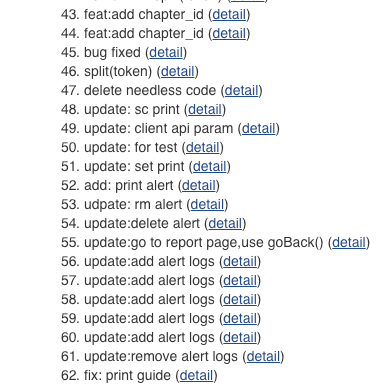

## git-rebase

使用 Git 已经好几年了，却始终只是熟悉一些常用的操作。对于 Git Rebase 却很少用到，直到这一次，不得不用。

### 背景

上线构建的过程中扫了一眼代码变更，突然发现，`commit` 提交竟然多达 `62` 次。我们来看看都提交了什么东西：



这里我们先不说 `git` [提交规范](http://jartto.wang/2018/07/08/git-commit/)，就单纯这么多次无用的 `commit` 就很让人不舒服。可能很多人觉得无所谓，无非是多了一些提交纪录。

`然而，并非如此，你可能听过破窗效应，编程也是如此！`

### 导致的问题

1.不利于代码 `review`
设想一下，你要做 `code review` ，结果一个很小的功能，提交了 `60` 多次，会不会有一些崩溃？

2.会造成分支污染
你的项目充满了无用的 `commit` 纪录，如果有一天线上出现了紧急问题，你需要回滚代码，却发现海量的 `commit` 需要一条条来看。

`遵循项目规范才能提高团队协作效率，而不是随心所欲。`

### Rebase 场景一：如何合并多次提交纪录？

基于上面所说问题，我们不难想到：每一次功能开发， 对多个 commit 进行合并处理。

这时候就需要用到 `git rebase` 了。这个命令没有太难，不常用可能源于不熟悉，所以我们来通过示例学习一下。

1.我们来合并最近的 4 次提交纪录，执行：

```shell
git rebase -i HEAD~4
```

2.这时候会进入vi模式：

```shell
pick 8350aea add:linked
pick 8398113 add linked
pick 3a46c2e add:koa-compose
pick 0f27595 fix:sort readme

# Rebase 2e61f8b..0f27595 onto 2e61f8b (4 commands)
#
# Commands:
# p, pick <commit> = use commit
# r, reword <commit> = use commit, but edit the commit message
# e, edit <commit> = use commit, but stop for amending
# s, squash <commit> = use commit, but meld into previous commit
# f, fixup <commit> = like "squash", but discard this commit's log message
# x, exec <command> = run command (the rest of the line) using shell
# b, break = stop here (continue rebase later with 'git rebase --continue')
# d, drop <commit> = remove commit
# l, label <label> = label current HEAD with a name
# t, reset <label> = reset HEAD to a label
# m, merge [-C <commit> | -c <commit>] <label> [# <oneline>]
# .       create a merge commit using the original merge commit's
# .       message (or the oneline, if no original merge commit was
# .       specified). Use -c <commit> to reword the commit message.
#
# These lines can be re-ordered; they are executed from top to bottom.
#
# If you remove a line here THAT COMMIT WILL BE LOST.
#
# However, if you remove everything, the rebase will be aborted.
#
# Note that empty commits are commented out
```

有几个命令需要注意一下：

- p, pick = use commit
- r, reword = use commit, but edit the commit message
- e, edit = use commit, but stop for amending
- s, squash = use commit, but meld into previous commit
- f, fixup = like “squash”, but discard this commit’s log message
- x, exec = run command (the rest of the line) using shell
- d, drop = remove commit

按照如上命令来修改你的提交纪录：

```shell
s 8350aea add:linked
s 8398113 add linked
s 3a46c2e add:koa-compose
p 0f27595 fix:sort readme
```

3.如果保存的时候，你碰到了这个错误：

```shell
error: cannot 'squash' without a previous commit
```

注意不要合并先前提交的东西，也就是已经提交远程分支的纪录。

4.如果你异常退出了 `vi` 窗口，不要紧张：

```shell
git rebase --edit-todo
```

这时候会一直处在这个编辑的模式里，我们可以回去继续编辑，修改完保存一下：

```shell
git rebase --continue
```

5.查看结果

```shell
git log
```

`三次提交合并成了一次，减少了无用的提交信息。`

