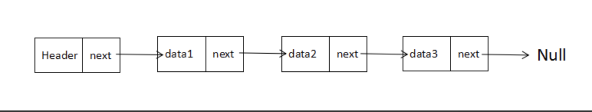
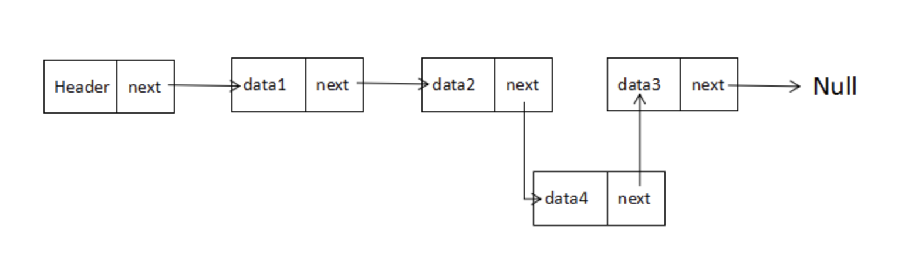

## 链表

除了对数据的随机访问，链表几乎可以用在任何可以使用一维数组的地方

链表是由一系列的节点组成的集合，每个节点都使用一个对象的引用指向它的后继，指向另一个节点的引用叫链。

### 单链表

#### 单链表操作

因为单链表包含节点，这两者的构造函数可以是两个独立的构造函数，所以我们需要些构造函数：`Node` 和 `SinglyList`

### **Node**

- `data` 存储数据
- `next` 指向链表中下一个节点的指针

### LList

- `_length` 用于表示链表中的节点数量
- `head` 分配一个节点作为链表的头
- `insert(value)` 向链表中添加一个节点
- `find(position)` 找到在列表中指定位置 n 上的节点
- `remove(position)` 删除指定位置的节点

#### 单链表操作

在实现时，我们首先定义一个名为`Node`的构造函数，然后定义一个名为`SinglyList`的构造函数。

`Node` 的每个实例都应该能够存储数据并且能够指向另外一个节点。 要实现此功能，我们将分别创建两个属性：`data`和`next`。

**读取**

单向链表（单链表）是链表的一种，其特点是链表的链接方向是单向的，对链表的访问要通过顺序读取从头部开始。



**插入**

向单向链表插入一个节点，需要修改它前面的节点（前驱）使其指向新加入的节点，而新加入的节点则指向原来前驱指向的节点



```javascript
/**
 * 一个简单的单向链表
 * @constructor
 */
// 节点
function Node(element) {
  this.element = element;   //当前节点的元素
  this.next = null;         //下一个节点链接
}
//链表类
function LList () {
  this.head = new Node( 'head' ); //头节点
  this.find = find;               //查找节点
  this.insert = insert;           //插入节点
  this.remove = remove;           //删除节点
  this.findPrev = findPrev;       //查找前一个节点
  this.display = display;         //显示链表
}
//查找节点
function find(item) {
  var currNode = this.head
  while(currNode.element !== item) {
    currNode = currNode.next
  }
  return currNode
}
//插入节点
function insert(newElement, item) {
  var newNode = new Node(newElement)
  var currNode = this.find(item)
  newNode.next = currNode.next
  currNode.next = newNode
}
//删除节点
function remove(item) {
  var prevNode = this.findPrev(item)
  var currNode = this.find(item)
  if(prevNode.next !== null) {
    prevNode.next = prevNode.next.next
    currNode.next = null
  }

}
//查找前一个节点
function findPrev(item) {
  var currNode = this.head
  while(currNode.next !== null && currNode.next.element !== item) {
    currNode = currNode.next
  }
  return currNode
}
//显示链表
function display() {
  var currNode = this.head
  while(currNode.next !== null) {
    currNode = currNode.next
    console.log(currNode.element)
  }
}
var llist = new LList()
llist.insert('小黑', 'head')
llist.insert('小白', '小黑')
llist.insert('小紫', '小白')
llist.insert('小蓝', '小紫')
llist.display()
llist.remove('小白')
llist.display()
```

