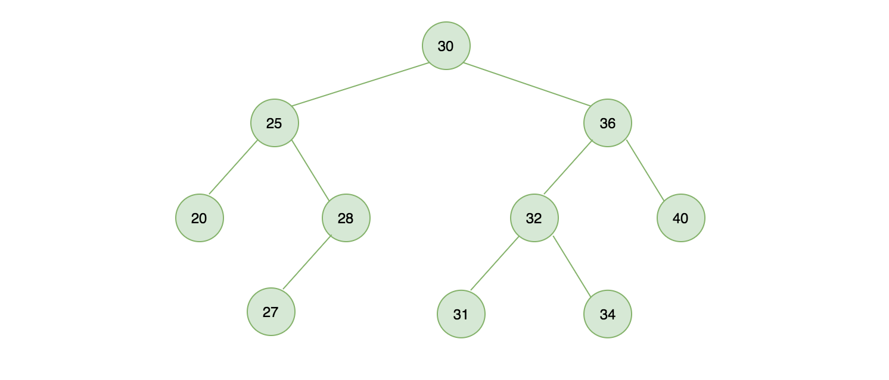
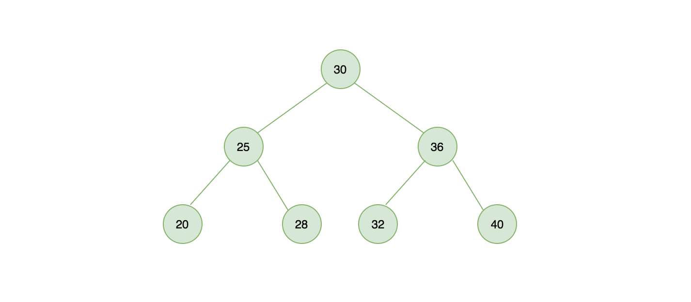
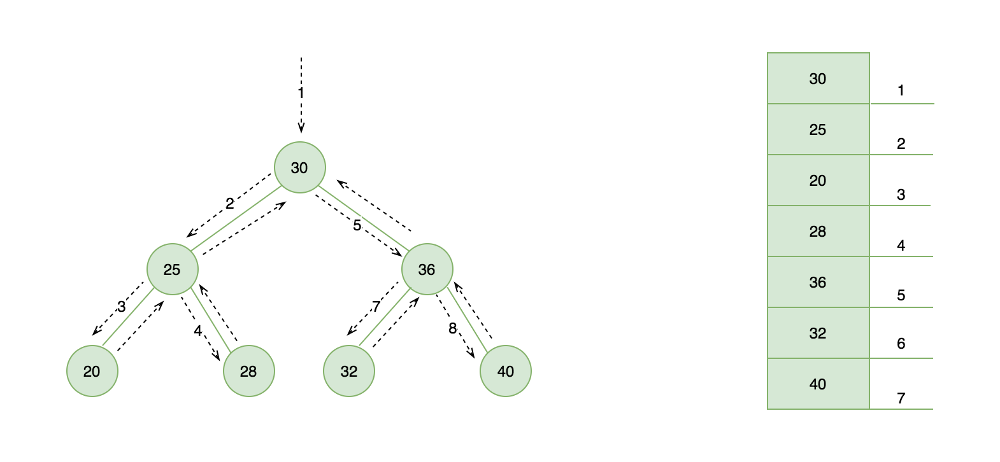

## ··分别为左侧节点、右侧节点。

二叉搜索树是二叉树中的一种，在二叉搜索树中每个父节点的键值要大于左边子节点小于右边子节点。下图展示一颗二叉搜索树。



### 二叉搜索树实现大纲

接下来我们使用JS实现一个二叉搜索树：

* Constructor: 构造函数，初始化一个二叉搜索树
* insert(value):插入节点
* search(value):二叉树中查找一个节点，如果存在返回true，不存在返回false
* perOrderTraverse(cb):先序遍历或前序遍历
* inOrderTraverse(cb): 中序遍历
* postOrderTraverse(cb): 后序遍历
* minNodeValue():最小节点值
* maxNodeValue():  最大节点值
* removeNode(value): 移除节点
* detroy(): 销毁节点


**注意**：在实现二叉树搜索🌲的很多方法中我们将使用大量的递归操作，如果对它不了解的，可以自行查阅资料学习。

### 初始化一个二叉树

声明一个BST类，在构造函数的contructor里声明它的结构

```javascript
class BST {
    constructor () {
        this.root = null; // 初始化根节点
        this.count = 0; // 记录二叉搜索的节点数量

        /**
         * 实例化一个 node 节点，在 insert 方法中你会看到
         */
        this.Node = function(value) {
            return {
                value, // 节点值
                count: 1, // 节点数量，允许节点重复
                left: null, // 左侧子节点
                right: null, // 右侧子节点
            }
        }
  }
```


### 二叉树插入节点

定义 insert 插入方法，接受一个 value 我们即将要插入的节点的值，在内部方法中调用 INSERT_RECUSIVE() 这个递归函数实现节点插入，返回结果给到 root。

```javascript
/**
 * 二叉搜索树插入元素
 * @param { Number } value 
 */
insert(value) {
    this.root = this[INSERT_RECUSIVE](this.root, value);
}
```

INSERT_RECUSIVE 使用 Symbol 进行声明

```javascript
const INSERT_RECUSIVE = Symbol('BST#recursiveInsert');
```

主要目的为实现私有化，仅类内部调用，类似于 Private 声明。

```javascript
/**
 * 递归插入
 * 插入过程和链表类似，建议先学习链表会更容易理解
 * @param { Object } node 
 * @param { Number } value 
 */
[INSERT_RECUSIVE](node, value) {
    // {1} 如果当前节点为空，创建一个新节点（递归到底）
    if (node === null) {
        this.count++; // 节点数加 1
        return new this.Node(value);
    }

    // {2} 节点数不变，说明要更新的值等于二叉树中的某个节点值
    if (value === node.value) {
        node.count++; // 节点数加 1
    } else if (value < node.value) { // {3} 新插入子节点在二叉树左边，继续递归插入
        node.left = this[INSERT_RECUSIVE](node.left, value);
    } else if (value > node.value) { // {4} 新插入子节点在二叉树右边，继续递归插入
        node.right = this[INSERT_RECUSIVE](node.right, value);
    }

    return node;
}
```

下图给出一个树结构图，我们使用刚刚写好的代码进行测试，生成如下结构所示的二叉搜索树：



刚开始我需要 new 一个 bST 对象实例，执行 insert 方法插入节点

- 第一次执行 bST.insert(30) 树是空的，代码行 {1} 将会被执行调用 new this.Node(value) 插入一个新节点。
- 第二次执行 bST.insert(25) 树不是空的，25 比 30 小（value < node.value），代码行 {3} 将会被执行，在树的左侧递归插入并调用 INSERT_RECUSIVE 方法传入 node.left，第二次递归时由于 node.left 已经为 null，所以插入新节点
- 第三次执行 bST.insert(36) 同理，执行顺序为 {4} -> 递归 {1}

```javascript
const bST = new BST();

bST.insert(30);
bST.insert(25);
bST.insert(36);
bST.insert(20);
bST.insert(28);
bST.insert(32);
bST.insert(40);

console.dir(bST, { depth: 4 })
```


### 二叉树查找节点

在 JavaScript 中我们可以通过 hasOwnProperty 来检测指定 key 在对象是否存在，现在我们在二叉搜索中实现一个类似的方法，传入一个值 value 判断是否在二叉搜索树中存在

```javascript
/**
 * 二叉树中搜索节点
 * @param { Number } value 
 * @return { Boolean } [true|false]
 */
search(value) {
    return this[SEARCH_RECUSIVE](this.root, value);
}
```

同样声明一个 SEARCH_RECUSIVE 辅助函数实现递归搜索查找

- 行 {1} 先判断传入的 node 是否为 null，如果为 null 就表示查找失败，返回 false。
- 行 {2} 说明已经找到了节点，返回 true。
- 行 {3} 表示要找的节点，比当前节点小，在左侧节点继续查找。
- 行 {4} 表示要找的节点，比当前节点大，在右侧节点继续查找。


```javascript
/**
 * 递归搜索
 * @param { Object } node 
 * @param { Number } value 
 */
[SEARCH_RECUSIVE](node, value) {
    if (node === null) { // {1} 节点为 null
        return false;
    } else if (value === node.value) { // {2} 找到节点
        return true;
    } else if (value < node.value) { // {3} 从左侧节点搜索
        return this[SEARCH_RECUSIVE](node.left, value);
    } else { // {4} 从右侧节点搜索
        return this[SEARCH_RECUSIVE](node.right, value);
    }
}
```

上面我们已经在树中插入了一些节点，现在进行测试，20 在树中是有的，返回了 true，而树中我们没有插入过 10 这个值，因此它返回了 false。

```javascript
bST.search(20); // true
bST.search(10); // false
```

### 二叉搜索树遍历

遍历是一个很常见的操作，后续再学习其它树相关结构中也都会用到，对一颗树的遍历从哪里开始？顶端，底端还是左右呢？不同的方式带来的结果是不同的、共分为前序，中序，后序三种方式遍历。

#### 先序遍历

优先于后代节点的顺序访问每个节点。

```javascript
/**
 * 先序遍历（前序遍历）
 * @param { Function } cb 
 */
preOrderTraverse(cb) {
    return this[PRE_ORDER_TRAVERSE_RECUSIVE](this.root, cb);
}
```

声明 PRE_ORDER_TRAVERSE_RECUSIVE 辅助函数进行前序遍历，步骤如下：

- 行 {1} 先访问节点本身（从树的顶端开始）
- 行 {2} 访问左侧节点
- 行 {3} 访问右侧节点

```javascript
/**
 * 先序遍历递归调用
 * @param { Object } node 
 * @param { Function } cb 
 */
[PRE_ORDER_TRAVERSE_RECUSIVE](node, cb) {
    if (node !== null) {
        cb(node.value); // {1} 先访问节点本身（从树的顶端开始）
        this[PRE_ORDER_TRAVERSE_RECUSIVE](node.left, cb); // {2} 访问左侧节点
        this[PRE_ORDER_TRAVERSE_RECUSIVE](node.right, cb); // {3} 访问右侧节点
    }
}
```

下图左侧展示了先序遍历的访问路径，右侧为输出。



#### 中序遍历

中序遍历，先访问左侧节点，直到为最小节点访问到树的最底端，将当前节点的 value 取出来，在访问右侧节点，适用于从小到大排序。

```javascript
/**
 * 中序遍历
 * @param { Function } cb 
 */
inOrderTraverse(cb) {
    return this[IN_ORDER_TRAVERSE_RECUSIVE](this.root, cb);
}
```


